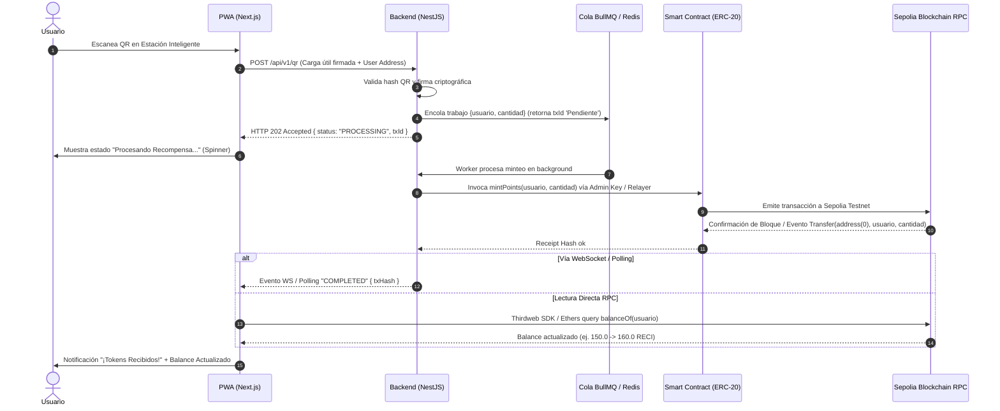

# 📑 Documentación de Contexto de Frontend: Reciclaje Inteligente Web

> **Propósito del Documento:** Proveer una visión técnica exhaustiva, arquitectónica y operativa del Frontend para agentes IA y desarrolladores que interactúen con la plataforma **Reciclaje Inteligente Web**. Incluye análisis de seguridad, resiliencia blockchain, UX Web3, diagramas de retorno y hoja de ruta para producción.

---

## 1. 🏗️ Arquitectura General del Monorepo

El proyecto está organizado en un monorepo gestionado mediante `pnpm` workspaces (`pnpm-workspace.yaml`). El código de frontend se divide en dos aplicaciones independientes según el rol de usuario:

```text
reciclaje-inteligente-web/
├── apps/
│   ├── dashboard/          → Panel de Administración e IoT (Vite + React 18 + TS + React Router v7)
│   └── pwa/                → Aplicación Web Progresiva para Usuarios (Next.js 14 + Web3 SDK + Ethers)
├── packages/
│   └── contracts/          → Contratos Inteligentes Hardhat (ERC-20 "PuntosReciclaje" $RECI)
└── FRONTEND_CONTEXT.md     → [Este documento]
```

---

## 2. 📊 Aplicación 1: Dashboard de Administración (`apps/dashboard`)

### 2.1 Descripción y Objetivos
El **Dashboard** es la plataforma administrativa central para monitorear en tiempo real la red de contenedores/estaciones de reciclaje inteligentes, analizar el rendimiento de la visión por computadora (IA) para la clasificación de residuos (Papel, Plástico, Metal), observar mapas de calor de volumen por zona y gestionar tokens de seguridad de cada estación IoT.

### 2.2 Stack Tecnológico
- **Framework / Bundler:** Vite `^5.1.0` + React `^18.2.0` + TypeScript `^5.3.3`
- **Enrutamiento:** `react-router-dom` `^7.18.2` (BrowserRouter, Routes, Route, Link, useParams, useNavigate)
- **Visualización de Datos:** `chart.js` `^4.4.1` + `react-chartjs-2` `^5.2.0`
- **Iconografía:** `lucide-react` `^0.330.0` + SVG embebidos personalizados
- **Estilos CSS:** CSS Nativo (`src/index.css`) con diseño futurista Glassmorphism, degradados de neón y respuestas responsivas (drawer móvil y sidebar de escritorio).

### 2.3 Estructura de Archivos (`apps/dashboard/src`)
```text
apps/dashboard/src/
├── main.tsx                → Punto de entrada React (ReactDOM.createRoot)
├── App.tsx                 → Enrutador principal, layout responsivo (Sidebar/Drawer) y Modal de Perfil
├── index.css               → Sistema de diseño (tokens de color, glass-card, animaciones de pulso, font-sans/mono)
├── config/
│   ├── api.ts              → Cliente HTTP (`useApi` hook), manejo de autenticación JWT y mock data fallbacks
│   └── app.ts              → Configuración del branding ("Reciclaje Inteligente")
├── types/
│   └── user.ts             → Tipo `User` (name, email, role, initials, accessLevel)
├── hooks/
│   └── useCountUp.ts       → Hook animado para contadores numéricos suaves
└── components/
    ├── Dashboard.tsx       → Página principal (KPIs, Feed en vivo, Heatmap, Horas pico)
    ├── Stations.tsx        → Vista principal de gestión de estaciones IoT
    ├── Login.tsx           → Pantalla de inicio de sesión con validación JWT
    ├── common/
    │   ├── ConfRing.tsx    → Anillo SVG para visualizar porcentajes de confianza de IA
    │   ├── DatePicker.tsx  → Selector de rango de fechas del dashboard
    │   ├── FillBar.tsx     → Barra de progreso de llenado de contenedores
    │   └── MatIcon.tsx     → Componente de íconos por material (papel, plástico, metal)
    ├── dashboard/
    │   ├── AIDetailsPage.tsx           → Vista detallada de diagnósticos de Visión Artificial
    │   ├── DashboardMetrics.tsx        → Tarjetas KPI (Material reciclado, Contaminación evitada, IA, Vaciados)
    │   ├── HeatMap.tsx                 → Grilla interactiva de zonas con código de colores según actividad
    │   ├── LiveFeed.tsx                → Feed de eventos de clasificación en tiempo real
    │   ├── MaterialBreakdownChart.tsx  → Gráfico de distribución de materiales
    │   ├── PeakHoursChart.tsx          → Gráfico de volumen de reciclaje por horas pico
    │   └── ZoneDetailPage.tsx          → Detalle específico de una zona seleccionada
    └── stations/
        ├── AddStationModal.tsx         → Modal para registrar nueva estación IoT
        ├── StationCard.tsx             → Tarjeta individual de estación
        ├── StationDetailPage.tsx       → Vista de detalle de estación con rotación/revocación de tokens
        └── TokenDisplay.tsx            → Despliegue de token criptográfico de autenticación de estación
```

### 2.4 Rutas y Navegación
| Ruta | Componente | Descripción |
| :--- | :--- | :--- |
| `/` | `Dashboard.tsx` | Muestra resumen de métricas en tiempo real, KPIs animadas, feed de clasificación, mapa de calor por zona y gráfico de horas pico. |
| `/estaciones` | `Stations.tsx` | Listado y filtrado de estaciones IoT por estado (`active`, `warning`, `offline`) y zona. Permite agregar estaciones y gestionar sus tokens de acceso. |
| `/zonas/:id` | `ZoneDetailPage.tsx` | Vista en profundidad de una zona específica (por ejemplo, UNITEC, Altara, Altia, City Mall) con métricas comparativas y listado de contenedores. |
| `/diagnostico-ia` | `AIDetailsPage.tsx` | Informe técnico del modelo de Visión Artificial, mostrando la confianza de clasificación por tipo de residuo y log de eventos recientes con etiquetas detectadas. |

### 2.5 Integración de API y Autenticación (`src/config/api.ts`)
- **Base URL:** `/api/v1` (Proxy a través de Nginx/Vite en producción/desarrollo).
- **Flujo Auth:**
  1. Si no hay usuario autenticado en la app, se presenta `Login.tsx`.
  2. Al autenticarse exitosamente, el servidor establece una cookie `httpOnly` de autenticación. Ya no se usa `sessionStorage`.
  3. El cliente HTTP usa `credentials: 'include'` en todas las peticiones para que la cookie viaje automáticamente. Se elimina el header `Authorization: Bearer`.
  4. En caso de recibir error HTTP `401 Unauthorized`, la aplicación redirige a la pantalla de login.
  5. El proceso de cierre de sesión llama a `POST /auth/logout` para limpiar la cookie e invalida el estado local del usuario.
  6. Contiene estructuras de datos de respaldo (`POOL`, `MAT`, `ZONAS`, `DATA`, `STATUS_CONFIG`) para garantizar el funcionamiento fluido en entornos sin conexión backend activa.

### 2.6 Actualizaciones Recientes (LiveFeed y Datos Reales)

- **LiveFeed.tsx (de mock a real + polling)**: Se migró de los datos simulados (`POOL`) a consumir el endpoint real `GET /api/v1/clasificacion?page=1&limit=20` mediante *polling* cada 6 segundos (dentro del rango de 5-10 s) usando `fetchWithAuth`. La respuesta paginada `{ data, total, page, limit }` se mapea a la fila del feed (material, estación y hora local) y se aplica un resaltado *flash* cuando aparece un evento nuevo. No se implementó WebSocket (decisión de alcance), el *polling* es la estrategia vigente.
- **ConfRing.tsx y MaterialBreakdownChart.tsx (ya consumían real)**: Ambos consumen `GET /api/v1/dashboard/metrics` (el primero vía `KPI_DATA.aiConf`, el segundo vía `metrics.monthlyData`). `ConfRing` renderiza el valor de confianza en escala 0-100 que devuelve el backend (`aiConf`) sin ajustes de escala adicionales; `MaterialBreakdownChart` grafica el desglose mensual por material y calcula su eje Y dinámicamente según el máximo de datos reales.
- **Normalización de confianza real (escala 0-1 → 0-100)**: El contrato del backend (`RegistrarEventoDto`) define `confianza` en el rango **[0, 1]** (p. ej. `0.98`). En `AIDetailsPage.tsx` se normaliza con `Math.round(confianza * 100)` antes de mostrarla como porcentaje, evaluar `isCorrect` (umbral ≥ 80%), aplicar el filtro de confianza mínima y dimensionar la barra de progreso, de modo que los valores reales de la IA se visualicen de forma equivalente a los mocks previos. Los valores `aiConf` / `iaAccuracyBreakdown` de las métricas ya llegan en 0-100.
- **Payload con QR**: El backend devuelve el QR generado en la misma respuesta del evento de clasificación (`POST /api/v1/clasificacion` incluye `codigo`, `firma`, `expiresAt`). Las vistas actuales del Dashboard (`LiveFeed`, `AIDetailsPage`) no muestran el QR (es funcional para la PWA/estación), por lo que no se realiza ninguna llamada adicional para consumirlo.

---

## 3. 📱 Aplicación 2: PWA para Usuarios Finales (`apps/pwa`)

### 3.1 Descripción y Objetivos
La **PWA** es la interfaz orientada a los usuarios finales que depositan residuos en los contenedores inteligentes. Les permite escanear el código QR desplegado en el contenedor tras clasificar un residuo, conectar su billetera Web3 (o ingresar mediante login social) y recibir tokens de recompensa `$RECI` (PuntosReciclaje).

### 3.2 Stack Tecnológico
- **Framework:** Next.js `^14.1.0` (App Router) + React `^18.2.0` + TypeScript `^5.3.3`
- **Integración Web3 / Blockchain:**
  - `thirdweb` `^5.0.0`
  - `@thirdweb-dev/react` `^4.1.20`
  - `@thirdweb-dev/sdk` `^4.0.99`
  - `ethers` `^5.7.2`
- **Iconografía:** `lucide-react` `^0.330.0`
- **Configuración PWA:** `public/manifest.json` (Standalone display, tema en tonos oscuros).

### 3.3 Estrategia de UX Web3 & Onboarding Ciudadano
Puesto que los usuarios finales son ciudadanos convencionales (no necesariamente usuarios cripto-nativos), la arquitectura contempla la abstracción de complejidad Web3:

1. **Autenticación Cripto-Nativa:** Conexión directa mediante MetaMask, Coinbase Wallet o WalletConnect.
2. **Onboarding Social / Billeteras Custodias Embebidas (Thirdweb / Privy):** Creación automática de billeteras mediante inicio de sesión con Google, Apple o número telefónico. El usuario no requiere gestionar *seed phrases* ni comprar ETH para gas.
3. **Transacciones Sin Gas (Gasless / Account Abstraction ERC-4337):** La emisión de tokens `$RECI` es financiada por el backend (*Relayer / Paymaster*), permitiendo que el usuario reciba puntos de forma 100% gratuita y transparente.

---

## 4. 🎨 Sistema de Diseño y Estilos (Design System)

Tanto el Dashboard como la PWA comparten una identidad visual unificada basada en un **estilo Cyberpunk / Eco-Tech Moderno**:

### Paleta de Colores Principal
- **Fondo Principal:** `#0a0f1d` / `#0f172a` (Azul Noche Oscuro)
- **Superficies Glassmorphic:** `rgba(22, 31, 53, 0.85)` con `backdrop-filter: blur(20px)` y bordes translúcidos `rgba(99, 231, 182, 0.12)`.
- **Verde Neón (Papel / Éxito / Marca):** `#a3e635` / `#10b981` / `#34d399`
- **Cian / Turquesa (Plástico / Info):** `#22d3ee` / `#06b6d4`
- **Púrpura / Violeta (Metal / Alertas):** `#a78bfa`
- **Amarillo Alerta / Rojo Error:** `#fbbf24` / `#ef4444`

### Tipografía
- **Fuentes:** Inter / Outfit / System Sans Serif para cuerpo y UI general.
- **Números / Métricas:** `var(--font-mono)` o monospace estilizado para balances, confianzas y UUIDs de estación.

---

## 5. ⚡ Flujo Criptográfico, Seguridad y Resiliencia Blockchain

### 5.1 Diagrama de Secuencia Completo (Ida y Bucle de Retorno)



---

### 5.2 Análisis de Seguridad de la Clave Privada (Admin Wallet)

La función `mintPoints(address usuario, uint256 cantidad)` en el contrato `RecompensasReciclaje.sol` está protegida por el modificador `onlyOwner`.

* **Estado Actual (MVP / Hackathon Demo):** La `ADMIN_PRIVATE_KEY` se almacena como variable de entorno (`.env`) en el contenedor del Backend NestJS.
* **Riesgo Identificado:** Si el servidor backend es vulnerado o la variable `.env` se expone, un atacante podría firmar transacciones arbitrarias y mintear tokens `$RECI` ilimitadamente.
* **Mitigación y Hoja de Ruta para Producción:**
  1. **KMS / HSM (Key Management Service):** Migrar a **AWS KMS**, **Google Cloud KMS** o **Vault Transit Engine** de HashiCorp. La clave privada nunca existe en memoria del servidor ni en archivos en disco; las transacciones son enviadas al KMS para su firma remota.
  2. **OpenZeppelin Defender Relayer:** Utilizar un *Relayer* administrado con políticas de seguridad de *gas price* y rotación de claves.
  3. **Límites a Nivel de Smart Contract:** Implementar topes máximos de emisión por transacción (`maxMintPerTx`) y límites diarios agregados (*Circuit Breaker*).

---

### 5.3 Resiliencia en Redes Blockchain (Congestión y Fallas en Sepolia)

Las redes de prueba como Sepolia (y las redes principales de Ethereum/L2) experimentan variaciones de gas y tiempos de confirmación:

1. **Gestión de Transacciones Pendientes:** El backend utiliza **BullMQ + Redis** para encolar las solicitudes de minteo.
2. **Estrategia de Reintentos (*Backoff Exponential*):** Si la solicitud falla por caída de RPC o timeout de red, el trabajo se reintenta automáticamente con esperas exponenciales.
3. **Sustitución de Nonce (*Speed-up Transactions*):** Si el precio del gas se eleva bruscamente, el worker del backend emite la misma transacción con una tarifa de gas mayor (*gas tip*) para evitar transacciones atascadas.
4. **Experiencia de Usuario en PWA:** El usuario no se queda bloqueado esperando la blockchain. La PWA recibe una confirmación inmediata de *"Solicitud Recibida (Pendiente)"* y actualiza de fondo la interfaz mediante *polling* o WebSockets en cuanto la transacción es minada en bloque.

---

## 6. 📜 Especificaciones Técnicas del Smart Contract

| Parámetro | Configuración / Valor |
| :--- | :--- |
| **Nombre del Contrato** | `RecompensasReciclaje.sol` |
| **Estándar** | ERC-20 (`OpenZeppelin Contracts v5.x`) |
| **Nombre / Símbolo del Token** | **PuntosReciclaje** (`RECI`) |
| **Compilador Solidity** | `^0.8.20` |
| **Optimizador Hardhat** | `enabled: true`, `runs: 200` |
| **Red de Despliegue** | Ethereum Sepolia Testnet (`chainId: 11155111`) |
| **Modificadores Críticos** | `onlyOwner` asignado únicamente a la Wallet Administradora |
| **Verificación en Etherscan** | Configurado en `hardhat.config.ts` vía `@nomicfoundation/hardhat-toolbox` |

---

## 7. ⚖️ Estado Actual (Demo / MVP) vs. Hoja de Ruta a Producción

| Componente | Estado Actual (MVP / Hackathon Demo) | Requisito para Producción Comercial |
| :--- | :--- | :--- |
| **Gestión Key Admin** | `.env` (`ADMIN_PRIVATE_KEY`) | **AWS KMS / Vault HSM** / Defender Relayer |
| **Gestión de Transacciones** | Scaffolding directo / Mock Hash | **Cola BullMQ + Redis** con reintentos y ajuste dinámico de gas |
| **Onboarding Web3** | MetaMask / Simulación `0x71C...4f9` | **Social Login + Account Abstraction (ERC-4337)** sin gas fees para usuario |
| **Feedback PWA** | Actualización de estado local/simulado | **WebSockets / SSE + Polling RPC direct** con banner "Pendiente" |
| **Verificación Contrato** | Código compilado en Hardhat | **Verificado en Sepolia/Polygon Etherscan** con auditoría de seguridad |

---

## 8. 🚀 Guía de Comandos para Agentes y Desarrolladores

Para ejecutar, probar o construir los proyectos de frontend desde la raíz del monorepo:

### Ejecución en Desarrollo
```bash
# Iniciar Dashboard (Vite - Port 3001)
pnpm dev:dashboard

# Iniciar PWA (Next.js - Port 3002)
pnpm dev:pwa
```

### Compilación para Producción
```bash
# Compilar todo el monorepo (Dashboard, PWA, Backend, Contracts)
pnpm build

# Compilar solo el Dashboard
pnpm --filter dashboard build

# Compilar solo la PWA
pnpm --filter pwa build
```

---

> **Nota para futuros Agentes IA:** Al realizar modificaciones en el frontend:
> 1. Respeta el diseño oscuro glassmorphism y la paleta de colores predefinida (`#a3e635`, `#22d3ee`, `#a78bfa`).
> 2. Mantén los contratos de tipos en `src/config/api.ts` o `src/types/` alineados con los DTOs de NestJS en `apps/backend/src`.
> 3. Asegúrate de probar responsive design tanto en pantallas pequeñas (PWA `<480px`, Dashboard mobile drawer) como en monitores de escritorio.
