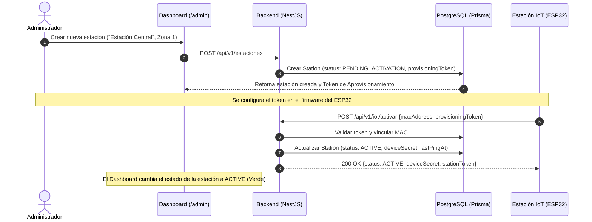
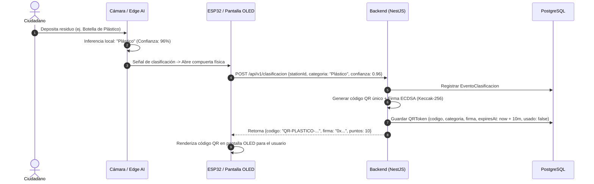
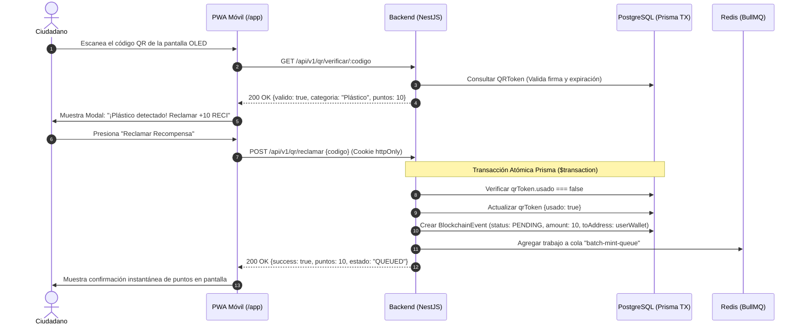
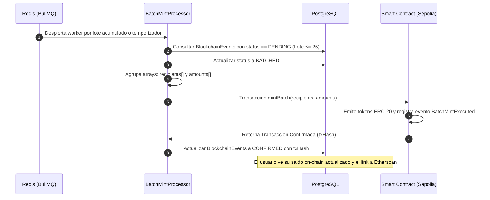
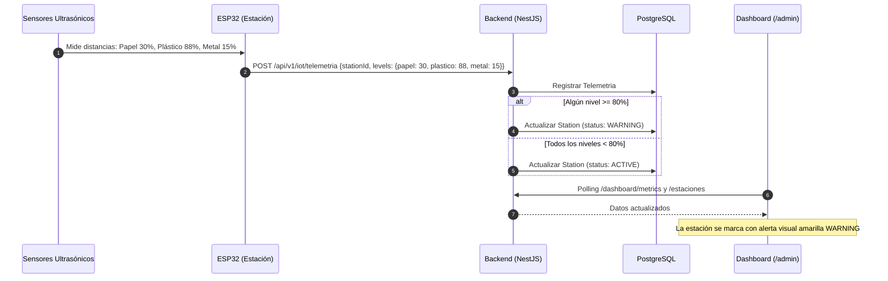
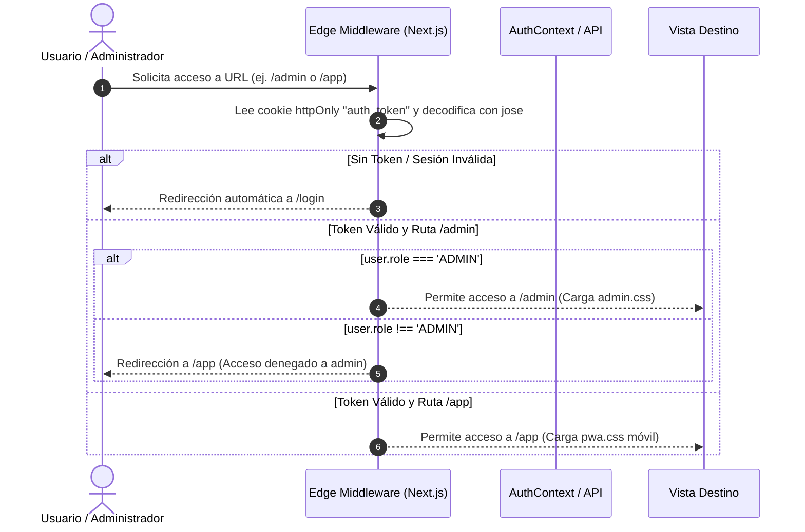
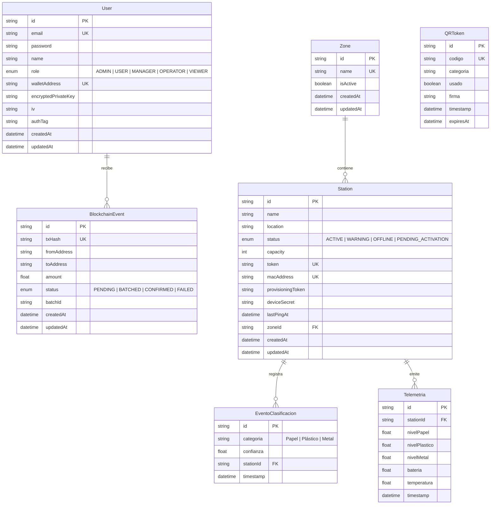

# 📘 CleanCity — Documentación Técnica Integral del Sistema
## Plataforma de Reciclaje Inteligente con Trazabilidad IoT, Telemetría, Visión Computacional y Recompensas Web3

---

## 📑 Tabla de Contenidos
1. [Resumen Ejecutivo e Inventario de lo Implementado](#1-resumen-ejecutivo-e-inventario-de-lo-implementado)
2. [Estructura del Proyecto y Arquitectura del Monorepo](#2-estructura-del-proyecto-y-arquitectura-del-monorepo)
3. [Tecnologías Utilizadas y Justificación Técnica ("El Porqué")](#3-tecnologías-utilizadas-y-justificación-técnica-el-porqué)
4. [Módulos del Sistema y Detalle Técnico: ¿Cómo se Hizo Cada Parte?](#4-módulos-del-sistema-y-detalle-técnico-cómo-se-hizo-cada-parte)
   - 4.1 [Módulo Blockchain y Smart Contracts (Solidity ERC-20 + BullMQ + Vault)](#41-módulo-blockchain-y-smart-contracts-solidity-erc-20--bullmq--vault)
   - 4.2 [Aplicación Móvil PWA Ciudadana (Next.js 14 + html5-qrcode + Web3)](#42-aplicación-móvil-pwa-ciudadana-nextjs-14--html5-qrcode--web3)
   - 4.3 [Backend Core y Base de Datos (NestJS 10 + Prisma + PostgreSQL)](#43-backend-core-y-base-de-datos-nestjs-10--prisma--postgresql)
   - 4.4 [Motor Criptográfico de Códigos QR y Anti-Replay](#44-motor-criptográfico-de-códigos-qr-y-anti-replay)
   - 4.5 [Ingestión IoT y Aprovisionamiento Zero-Touch de Estaciones](#45-ingestión-iot-y-aprovisionamiento-zero-touch-de-estaciones)
   - 4.6 [Centro de Control Administrativo (EcoGridAI Dashboard)](#46-centro-de-control-administrativo-ecogridai-dashboard)
5. [Procesos y Flujos de Funcionamiento Paso a Paso (Diagramas Mermaid)](#5-procesos-y-flujos-de-funcionamiento-paso-a-paso-diagramas-mermaid)
   - 5.1 [Flujo 1: Aprovisionamiento y Activación Zero-Touch de Estación IoT](#51-flujo-1-aprovisionamiento-y-activación-zero-touch-de-estación-iot)
   - 5.2 [Flujo 2: Clasificación de Residuos y Emisión de QR Criptográfico](#52-flujo-2-clasificación-de-residuos-y-emisión-de-qr-criptográfico)
   - 5.3 [Flujo 3: Escaneo, Verificación y Reclamo Atómico de Puntos](#53-flujo-3-escaneo-verificación-y-reclamo-atómico-de-puntos)
   - 5.4 [Flujo 4: Liquidación por Lotes en Blockchain (BullMQ Batch Minting)](#54-flujo-4-liquidación-por-lotes-en-blockchain-bullmq-batch-minting)
   - 5.5 [Flujo 5: Telemetría Ultrasónica y Disparo de Alertas Preventivas](#55-flujo-5-telemetría-ultrasónica-y-disparo-de-alertas-preventivas)
   - 5.6 [Flujo 6: Autenticación Segura y Control de Acceso RBAC en Edge](#56-flujo-6-autenticación-segura-y-control-de-acceso-rbac-en-edge)
6. [Modelo de Datos (Diagrama Entidad-Relación de PostgreSQL)](#6-modelo-de-datos-diagrama-entidad-relación-de-postgresql)
7. [Métricas de Calidad, Pruebas y Seguridad](#7-métricas-de-calidad-pruebas-y-seguridad)

---

## 1. Resumen Ejecutivo e Inventario de lo Implementado

La plataforma **CleanCity (Reciclaje Inteligente Web)** es un ecosistema tecnológico de nivel de producción que conecta el mundo físico del reciclaje urbano con la trazabilidad digital y la economía de incentivos Web3.

```
┌──────────────────────────────────────────────────────────────────────────────────────────────────┐
│                                 ARQUITECTURA INTEGRAL CLEANCITY                                  │
├─────────────────────────┬───────────────────────────────┬────────────────────────────────────────┤
│   CAPA FÍSICA & IoT     │      CAPA CORE & COLAS        │       CAPA CLIENTE & BLOCKCHAIN        │
│                         │                               │                                        │
│ • Microcontrolador      │ • NestJS 10 REST API          │ • Smart Contract ERC-20 ($RECI)        │
│   ESP32 (Dual Core)     │ • PostgreSQL 15 + Prisma ORM  │   en Ethereum Sepolia                  │
│ • Sensores Ultrasónicos │ • Redis 7 + BullMQ Worker     │ • Admin Dashboard (/admin)             │
│ • Pantalla OLED QR      │ • AES-256-GCM + Vault Custodia│ • PWA Ciudadana Móvil (/app)           │
│ • Ingestión REST        │ • Rate Limiter & Helmet       │ • Service Worker Offline Cache         │
└─────────────────────────┴───────────────────────────────┴────────────────────────────────────────┘
```

### ✅ Inventario de Componentes Construidos:
1. **Backend REST API (NestJS 10)**: 8 módulos de negocio completos, control de roles, logging estructurado con Pino, filtros globales de excepción y validación estricta de DTOs.
2. **Base de Datos Relacional (PostgreSQL 15)**: 7 modelos de datos normalizados con índices optimizados y restricciones de unicidad.
3. **Smart Contract Solidity 0.8.20 (`RecompensasReciclaje.sol`)**: Token ERC-20 `$RECI` con emisión en lote (`mintBatch`), control de acceso OpenZeppelin 5.x y pausa de emergencia.
4. **Sistema de Colas Asíncronas (BullMQ + Redis 7)**: Procesador en segundo plano para batch minting con reintentos exponenciales y reducción de gas >70%.
5. **Custodia Criptográfica de Wallets**: Generación de billeteras en el registro con claves privadas cifradas en AES-256-GCM y secretos en HashiCorp Vault.
6. **Motor Criptográfico QR**: Generación de códigos con firma ECDSA/Keccak256, TTL de 10 min y canje atómico con bloqueo anti-replay (`409 Conflict`).
7. **Centro de Control Administrativo (EcoGridAI)**: Dashboard en tiempo real, KPIs de impacto ecológico, gráficos interactivos de horas pico, mapas de calor por zonas y administración de estaciones IoT.
8. **PWA Móvil Ciudadana**: Escáner de QR por cámara trasera (`html5-qrcode`), carga de archivos, simulación de canje, balance Web3 en vivo e historial on-chain.
9. **Seguridad Integral**: Cookies `httpOnly` contra XSS, CORS restringido, Helmet headers y Throttling por IP.
10. **Infraestructura de QA**: 270 pruebas automatizadas con 100% de aprobación (Unitarias, Integración y 4 Tiers E2E).

---

## 2. Estructura del Proyecto y Arquitectura del Monorepo

El proyecto está organizado como un **Monorepo** administrado mediante `pnpm workspaces`:

```
reciclaje-inteligente-web/
├── apps/
│   ├── backend/                      # API RESTful en NestJS 10 + Prisma + BullMQ
│   │   ├── prisma/
│   │   │   └── schema.prisma         # Esquema de base de datos PostgreSQL
│   │   └── src/
│   │       ├── auth/                 # Login, Registro, JWT httpOnly, Guards y RBAC
│   │       ├── blockchain/           # Ethers.js v6, BullMQ Queue, BatchMintProcessor, Vault
│   │       ├── clasificacion/        # Registro de eventos de visión artificial y cálculo de puntos
│   │       ├── common/               # Filtros de excepción, Logger Pino, Guards globales
│   │       ├── dashboard/            # Agregaciones de métricas, KPIs, datos mensuales
│   │       ├── estaciones/           # CRUD de estaciones, filtrado, revocación de tokens
│   │       ├── health/               # Terminus healthcheck (DB y memoria)
│   │       ├── iot/                  # Aprovisionamiento ESP32, telemetría ultrasónica, pings
│   │       ├── qr/                   # Firma digital ECDSA, validación y reclamo atómico
│   │       ├── zones/                # CRUD y administración de zonas urbanas
│   │       ├── app.module.ts         # Módulo raíz con throttler y configuración
│   │       └── main.ts               # Inicialización, Swagger, CORS, Helmet y Pipes
│   └── pwa/                          # Frontend Consolidado en Next.js 14 App Router
│       ├── public/
│       │   └── manifest.json         # Manifiesto PWA para instalación móvil
│       └── src/
│           ├── app/
│           │   ├── admin/            # Rutas del Centro de Control Administrativo
│           │   │   ├── layout.tsx    # Layout administrativo con aislamiento de admin.css
│           │   │   ├── admin.css     # Estilos futuristas Glassmorphism (EcoGridAI)
│           │   │   ├── page.tsx      # Overview (/admin): KPIs, Heatmap, Horas Pico, Feed
│           │   │   ├── estaciones/   # Gestión de contenedores IoT (/admin/estaciones)
│           │   │   ├── ia-details/   # Diagnóstico del modelo de IA (/admin/ia-details)
│           │   │   ├── zonas/        # Analítica por zona individual (/admin/zonas/[id])
│           │   │   └── zonas-admin/  # CRUD de zonas (/admin/zonas-admin)
│           │   ├── app/              # Rutas de la PWA Ciudadana
│           │   │   ├── layout.tsx    # Layout móvil wrapper (max-width: 480px, pwa.css)
│           │   │   ├── pwa.css       # Estilos móviles orientados a usuario final
│           │   │   └── page.tsx      # Hub ciudadano: Escáner QR, Saldo $RECI, Historial
│           │   ├── login/            # Pantalla unificada de inicio de sesión
│           │   ├── register/         # Pantalla de registro de nuevos usuarios
│           │   ├── offline/          # Pantalla de fallback cuando no hay conexión
│           │   ├── layout.tsx        # RootLayout con AuthProvider global
│           │   └── page.tsx          # Despachador condicional en raíz (/)
│           ├── components/           # Componentes modulares UI
│           │   ├── admin/            # DashboardMetrics, LiveFeed, HeatMap, PeakHoursChart...
│           │   └── pwa/              # QrScanner, ClaimModal, BalanceCard, TransactionHistory...
│           ├── context/
│           │   └── AuthContext.tsx   # Estado global de sesión y sincronización con cookies
│           ├── lib/
│           │   └── api.ts            # Cliente HTTP tipado con credentials: 'include'
│           └── middleware.ts         # Edge RBAC Middleware (jose) para gating de rutas
├── packages/
│   └── contracts/                    # Entorno de Smart Contracts con Hardhat
│       ├── contracts/
│       │   └── RecompensasReciclaje.sol # Smart Contract ERC-20 con mintBatch y roles
│       ├── test/                     # 29 pruebas unitarias del contrato en Chai
│       └── hardhat.config.ts         # Configuración de compilador y redes Sepolia/Local
├── tests/
│   └── e2e/                          # Suite completa de pruebas E2E Opaque-Box
│       ├── tier1_features/           # 8 suites de cobertura funcional básica
│       ├── tier2_boundaries/         # 7 suites de pruebas de límites y seguridad
│       ├── tier3_combinations/       # 6 suites de integración entre subsistemas
│       └── tier4_workloads/          # 3 recorridos completos de ciclo de vida real
├── docs/                             # Documentación técnica, manuales y auditorías
│   ├── INFORME_TECNICO.md            # Informe consolidado de arquitectura
│   └── SECURITY_AUDIT.md             # Informe de auditoría de seguridad
└── docker-compose.yml                # Orquestación de contenedores en producción/demo
```

---

## 3. Tecnologías Utilizadas y Justificación Técnica ("El Porqué")

| Dominio | Tecnología Elegida | Alternativas Evaluadas | ¿Por qué se eligió esta tecnología? |
| :--- | :--- | :--- | :--- |
| **Backend Framework** | **NestJS 10 (TypeScript)** | Express.js puro, Fastify | Arquitectura modular orientada a objetos (módulos, controladores, servicios), inyección de dependencias nativa, tipado estricto con TypeScript, y soporte robusto para microservicios y colas. |
| **Base de Datos & ORM** | **PostgreSQL 15 + Prisma ORM** | MySQL, TypeORM, Mongo | Integridad relacional estricta, soporte de transacciones ACID aisladas (vital para evitar doble canje de QR), migraciones declarativas y generación automática de tipos seguros en TypeScript. |
| **Colas Asíncronas** | **BullMQ + Redis 7** | RabbitMQ, Apache Kafka | BullMQ se integra de forma nativa con Node.js/NestJS. Permite agrupar transacciones blockchain en lotes (*batching*), programar reintentos exponenciales automáticos y desacoplar la respuesta al usuario del tiempo de confirmación on-chain. |
| **Seguridad de Claves** | **AES-256-GCM + HashiCorp Vault** | Claves en texto plano en DB, MetaMask puro | El cifrado simétrico autenticado (AES-GCM) detecta manipulaciones en el payload con su `authTag`. La custodia en servidor permite que ciudadanos sin billetera Web3 previa participen sin fricción técnica, mientras que Vault aísla la clave maestra fuera del código. |
| **Smart Contract** | **Solidity 0.8.20 + OpenZeppelin 5.x** | ERC-721 (NFT), Contratos a medida | El estándar fungible ERC-20 es ideal para puntos de recompensa intercambiables (`$RECI`). OpenZeppelin 5.x provee estándares auditados contra reentrancia, control granular de roles (`AccessControl`) y pausa de emergencia (`Pausable`). |
| **Frontend Framework** | **Next.js 14 App Router** | Vite SPA separado, Create React App | Permite consolidar en un solo repositorio el Dashboard de administración y la PWA móvil, aislando estilos CSS (`admin.css` vs `pwa.css`), ejecutando validaciones de seguridad en el Edge (`middleware.ts`) y cargando librerías pesadas (`chart.js`) mediante *Dynamic Code Splitting*. |
| **Escaneo QR en Móvil** | **html5-qrcode** | jsQR, react-qr-reader | Soporte nativo para alternar entre cámaras traseras (modo entorno), control de linterna/enfoque, decodificación local por software y fallback para subida manual de imágenes. |
| **Testing E2E** | **Custom TS Opaque-Box Runner + Jest + Hardhat** | Cypress, Playwright | Permite simular peticiones HTTP reales desde la perspectiva del microcontrolador ESP32 y del navegador cliente, validando firmas criptográficas, transacciones blockchain y estados de base de datos sin acoplamiento interno. |

---

## 4. Módulos del Sistema y Detalle Técnico: ¿Cómo se Hizo Cada Parte?

### 4.1 Módulo Blockchain y Smart Contracts (Solidity ERC-20 + BullMQ + Vault)

#### A. Desarrollo del Smart Contract (`RecompensasReciclaje.sol`)
* **Ubicación:** `packages/contracts/contracts/RecompensasReciclaje.sol`
* **Herencia y Estándares:** Construido en **Solidity 0.8.20** heredando `ERC20`, `ERC20Burnable`, `ERC20Pausable` y `AccessControl` de **OpenZeppelin Contracts v5.x**.
* **Diseño y Optimización de Gas en `mintBatch`**:
  ```solidity
  function mintBatch(
      address[] calldata recipients,
      uint256[] calldata amounts
  ) external onlyRole(MINTER_ROLE) whenNotPaused returns (uint256 batchId) {
      uint256 recipientsLength = recipients.length;
      uint256 amountsLength = amounts.length;
      if (recipientsLength != amountsLength) revert ArrayLengthMismatch(recipientsLength, amountsLength);
      if (recipientsLength == 0) revert EmptyBatch();

      unchecked { currentBatchId += 1; }
      batchId = currentBatchId;

      for (uint256 i = 0; i < recipientsLength; ) {
          address recipient = recipients[i];
          uint256 amount = amounts[i];
          if (recipient == address(0)) revert ZeroAddressRecipient(i);
          _mint(recipient, amount);
          emit TokensMinted(recipient, amount, batchId);
          unchecked { i++; }
      }
      emit BatchMintExecuted(batchId, recipientsLength, totalAmount);
  }
  ```
* **Mecanismos Clave Implementados:**
  1. **Tipos de Memoria `calldata`:** Los parámetros `recipients` y `amounts` residen en `calldata` para no incurrir en costos de copia a memoria EVM.
  2. **Errores Personalizados (`custom errors`):** Se reemplazaron cadenas de texto `require()` por `revert ArrayLengthMismatch()` y `revert EmptyBatch()`, ahorrando bytes en el bytecode y gas en ejecución.
  3. **Bloques `unchecked`:** Los incrementos del contador `i++` y `currentBatchId += 1` se ejecutan en bloques sin chequeo de overflow, pues es matemáticamente imposible que desborden en un arreglo de longitud acotada.
  4. **Segregación de Roles:** `MINTER_ROLE` para el backend, `PAUSER_ROLE` para congelar transacciones ante anomalías y `DEFAULT_ADMIN_ROLE` para la gobernanza.

#### B. Generación y Custodia Criptográfica de Wallets (`WalletEncryptionService`)
* **Ubicación:** `apps/backend/src/blockchain/wallet-encryption.service.ts`
* **Mecánica de Cifrado AES-256-GCM**:
  1. Cuando un ciudadano se registra en la PWA, `ethers.Wallet.createRandom()` genera una dirección pública y una clave privada de 256 bits.
  2. La clave privada se cifra mediante el algoritmo simétrico autenticado **`aes-256-gcm`** usando `crypto.createCipheriv()`.
  3. Se genera un Vector de Inicialización (IV) criptográficamente seguro de 16 bytes (`crypto.randomBytes(16)`).
  4. Al finalizar el cifrado, se extrae la etiqueta de autenticación de 128 bits (`cipher.getAuthTag()`).
  5. En la tabla `users` de PostgreSQL se guardan únicamente `walletAddress`, `encryptedPrivateKey`, `iv` y `authTag`. **Ninguna clave privada se almacena en texto plano**.
  6. Si un atacante altera un solo bit del texto cifrado en la base de datos, el método `decipher.setAuthTag()` arroja una excepción impidiendo la descodificación.
* **Integración con HashiCorp Vault**:
  La clave maestra `WALLET_ENCRYPTION_KEY` y la clave del operador `ADMIN_PRIVATE_KEY` se aíslan en HashiCorp Vault (`http://vault:8200/v1/secret/reciclaje`), recuperándose dinámicamente en el arranque del servidor.

#### C. Procesador de Colas Asíncronas en Lote (`BatchMintProcessor`)
* **Ubicación:** `apps/backend/src/blockchain/batch-mint.processor.ts`
* **Mecánica de Procesamiento**:
  1. Cuando un usuario canjea un QR, el backend inserta un registro `BlockchainEvent` con estado `PENDING` y encola un trabajo en BullMQ (`batch-mint-queue`).
  2. El `@Processor(BLOCKCHAIN_QUEUE_NAME)` despierta y consulta hasta 25 eventos `PENDING` ordenados por antigüedad.
  3. Actualiza atómicamente los eventos a estado `BATCHED` con un identificador de lote `batch-TIMESTAMP-UUID`.
  4. Agrupa las direcciones destinatarias (`recipients[]`) y los montos correspondientes (`amounts[]`).
  5. Ejecuta la llamada on-chain `contract.mintBatch(recipients, amounts)` mediante un provider `ethers.JsonRpcProvider` conectado a Sepolia.
  6. Tras recibir el recibo de la transacción (`txReceipt`), actualiza todos los registros de la base de datos a `CONFIRMED`, guardando el `txHash` único para auditoría.
  7. En caso de fallas transitorias de RPC, BullMQ aplica reintentos automáticos con retroceso exponencial (*exponential backoff*).

---

### 4.2 Aplicación Móvil PWA Ciudadana (Next.js 14 + html5-qrcode + Web3)

#### A. Configuración PWA y Aislamiento de Service Worker
* **Ubicación:** `apps/pwa/next.config.js` y `apps/pwa/public/manifest.json`
* **¿Cómo se aisló la PWA del Dashboard Administrativo?**
  1. Se utilizó `@ducanh2912/next-pwa` configurando el alcance (`scope`) exclusivamente en `/app` (`start_url: '/app'`).
  2. En `customRuntimeCaching`, se insertó una regla `NetworkOnly` prioritaria para las rutas `/admin/**` y `/api/**`, garantizando que el Service Worker **nunca intercepte ni guarde en caché las pantallas administrativas ni las llamadas a la API REST**.
  3. Se configuró un fallback automático para documentos offline en `/offline`.

#### B. Componente Escáner de Códigos QR (`QrScanner.tsx`)
* **Ubicación:** `apps/pwa/src/components/QrScanner.tsx`
* **Integración de Hardware de Cámara con `html5-qrcode`**:
  1. Carga dinámica en el cliente (`await import('html5-qrcode')`) para evitar problemas con Server-Side Rendering (SSR).
  2. Enumeración automática de dispositivos de video (`Html5Qrcode.getCameras()`) y selección por defecto de la cámara trasera con `{ facingMode: 'environment' }`.
  3. Control del ciclo de vida: al desmontar el componente o cambiar de pestaña, se invoca `scannerRef.current.stop()` y `.clear()` para liberar los recursos de hardware y la linterna.
  4. **Modo Subida de Imagen (`mode === 'file'`)**: Permite seleccionar una foto de la galería del teléfono decodificándola con `html5QrCode.scanFile(file)`.
  5. **Presets de Demostración Instantánea**: 4 botones de acceso directo (+10 RECI Plástico, +15 RECI Metal, +5 RECI Papel, +8 RECI Vidrio) que generan payloads de prueba firmados para acelerar las evaluaciones en vivo sin requerir una cámara física.

#### C. Experiencia de Reclamo y Transacciones Web3
* **Modal de Recompensa ([`ClaimModal.tsx`](file:///home/fefo/Documentos/GitHub/reciclaje-inteligente-web/apps/pwa/src/components/ClaimModal.tsx))**:
  Al escanear un QR, se verifica la firma contra `GET /api/v1/qr/verificar/:codigo`. La interfaz despliega una tarjeta animada con el tipo de material detectado (Plástico, Papel, Metal) y el monto a ganar. Al pulsar "Reclamar Recompensa", se dispara la mutación a `POST /api/v1/qr/reclamar`.
* **Tarjeta de Saldo en Vivo ([`BalanceCard.tsx`](file:///home/fefo/Documentos/GitHub/reciclaje-inteligente-web/apps/pwa/src/components/BalanceCard.tsx))**:
  Consulta el balance real en Sepolia invocando `GET /api/v1/blockchain/balance/:address`, mostrando el saldo de tokens `$RECI` con tipografía de alto contraste y botón de refresco suave.
* **Historial de Transacciones ([`TransactionHistory.tsx`](file:///home/fefo/Documentos/GitHub/reciclaje-inteligente-web/apps/pwa/src/components/TransactionHistory.tsx))**:
  Lista los eventos de emisión on-chain asociados al usuario, acortando los hashes (`0x1234...5678`) y proveyendo enlaces directos al explorador `https://sepolia.etherscan.io/tx/{txHash}`.
* **Detección Offline ([`OfflineBanner.tsx`](file:///home/fefo/Documentos/GitHub/reciclaje-inteligente-web/apps/pwa/src/components/OfflineBanner.tsx))**:
  Escucha los eventos globales `window.addEventListener('online')` y `'offline'`, mostrando una alerta fija superior cuando se pierde la conexión a Internet.

#### D. Aislamiento de Estilos CSS (`pwa.css` vs `admin.css`)
* **Ubicación:** `apps/pwa/src/app/app/pwa.css` y `apps/pwa/src/app/admin/admin.css`
* Para evitar que los estilos futuristas del dashboard administrativo colisionen con la aplicación móvil, `pwa.css` se importa exclusivamente dentro de `src/app/app/layout.tsx` restringiendo el viewport a un contenedor centrado de ancho móvil (`max-width: 480px`).

---

### 4.3 Backend Core y Base de Datos (NestJS 10 + Prisma + PostgreSQL)

#### A. Arquitectura de Módulos
* **Ubicación:** `apps/backend/src/`
* Estructurado bajo el patrón modular de NestJS:
  * `AppModule` orquesta la configuración global (`ConfigModule.forRoot({ isGlobal: true })`), el logger Pino, el limitador de tasa `ThrottlerModule` y la conexión de colas con `BullModule.forRootAsync()`.
  * Filtro global de excepciones `AllExceptionsFilter` que intercepta errores de base de datos de Prisma (como violaciones de clave única `P2002`) y los traduce a respuestas HTTP estandarizadas.
  * Tubería global `ValidationPipe` con `{ whitelist: true, transform: true }` para sanitizar y rechazar cualquier propiedad no declarada en los DTOs.

#### B. Autenticación Segura con Cookies `httpOnly`
* **Ubicación:** `apps/backend/src/auth/`
* En lugar de almacenar tokens JWT en `localStorage` (vulnerable a robo mediante Cross-Site Scripting), el endpoint `POST /api/v1/auth/login` emite la cabecera:
  ```typescript
  res.cookie('auth_token', token, {
    httpOnly: true,
    secure: process.env.NODE_ENV === 'production',
    sameSite: 'lax',
    maxAge: 24 * 60 * 60 * 1000, // 1 día
  });
  ```
* En el cliente HTTP de la PWA y del Dashboard (`apps/pwa/src/lib/api.ts`), todas las peticiones utilizan `credentials: 'include'`, permitiendo que el navegador adjunte automáticamente la cookie sin intervención de JavaScript.

---

### 4.4 Motor Criptográfico de Códigos QR y Anti-Replay

#### A. Firma Digital del Payload QR
* **Ubicación:** `apps/backend/src/qr/qr.service.ts`
* Cuando la cámara de visión artificial clasifica un residuo, se genera un identificador único: `QR-PLASTICO-1718000000000-a1b2c3d4`.
* Se genera un digest criptográfico empaquetado mediante Keccak-256:
  ```typescript
  const messageHash = ethers.solidityPackedKeccak256(
    ['string', 'string', 'string'],
    [codigo, categoria, timestamp.toISOString()]
  );
  const firma = await this.operatorWallet.signMessage(ethers.getBytes(messageHash));
  ```
* El código se almacena en PostgreSQL con un tiempo de vida estricto: `expiresAt = new Date(Date.now() + 10 * 60 * 1000)` (10 minutos).

#### B. Reclamo Atómico y Bloqueo Anti-Replay
* Para impedir que un usuario duplique o reutilice un código QR mediante peticiones concurrentes, el canje se ejecuta dentro de una transacción interactiva de Prisma:
  ```typescript
  return await this.prisma.$transaction(async (tx) => {
    const qrToken = await tx.qRToken.findUnique({ where: { codigo } });
    if (!qrToken) throw new NotFoundException('Código QR no encontrado');
    if (qrToken.usado) throw new ConflictException('El código QR ya ha sido reclamado');
    if (new Date() > qrToken.expiresAt) throw new BadRequestException('El código QR ha expirado');

    // Validar firma criptográfica
    const signerAddress = ethers.verifyMessage(ethers.getBytes(messageHash), qrToken.firma);
    if (signerAddress.toLowerCase() !== this.operatorAddress.toLowerCase()) {
      throw new BadRequestException('Firma criptográfica inválida');
    }

    // Marcar como usado inmediatamente (quema del token)
    await tx.qRToken.update({
      where: { codigo },
      data: { usado: true },
    });

    // Crear evento de blockchain pendiente
    return await tx.blockchainEvent.create({
      data: {
        toAddress: userWalletAddress,
        amount: puntos,
        status: BlockchainEventStatus.PENDING,
      },
    });
  });
  ```

---

### 4.5 Ingestión IoT y Aprovisionamiento Zero-Touch de Estaciones

#### A. Aprovisionamiento Zero-Touch (`/api/v1/iot/activar`)
* **Ubicación:** `apps/backend/src/iot/iot.service.ts`
* **Flujo de Alta**:
  1. El administrador da de alta una estación física en el Dashboard asignándole un nombre y zona. El backend genera un `provisioningToken` criptográfico y deja la estación en estado `PENDING_ACTIVATION`.
  2. Al encenderse en la calle, el microcontrolador ESP32 envía un ping HTTP `POST /api/v1/iot/activar` enviando su dirección MAC física (`AA:BB:CC:DD:EE:FF`) y su `provisioningToken`.
  3. El backend verifica la concordancia, genera un `deviceSecret` simétrico y pasa la estación a estado `ACTIVE`.

#### B. Telemetría de Capacidad y Alertas de Llenado
* **Ubicación:** `apps/backend/src/iot/iot.service.ts` (`procesarTelemetria`)
* La estación envía periódicamente lecturas de sensores ultrasónicos:
  `{ nivelPapel: 35, nivelPlastico: 82, nivelMetal: 10, bateria: 95 }`.
* El servicio evalúa los compartimentos: si cualquiera supera el **80% de llenado**, actualiza el estado de la estación a `StationStatus.WARNING`. El Dashboard detecta este cambio en su siguiente ciclo de consulta y enciende el indicador de alerta para el personal de limpieza urbana.

---

### 4.6 Centro de Control Administrativo (EcoGridAI Dashboard)

#### A. Arquitectura y Componentes
* **Ubicación:** `apps/pwa/src/app/admin/` y `apps/pwa/src/components/admin/`
* **Estilo Visual**: Implementado bajo la guía de diseño *EcoGridAI* con tarjetas translúcidas Glassmorphism, anillos SVG interactivos ([`ConfRing.tsx`](file:///home/fefo/Documentos/GitHub/reciclaje-inteligente-web/apps/pwa/src/components/common/ConfRing.tsx)) y barras de progreso de llenado ([`FillBar.tsx`](file:///home/fefo/Documentos/GitHub/reciclaje-inteligente-web/apps/pwa/src/components/common/FillBar.tsx)).
* **Optimización de Carga con Dynamic Imports**:
  Las librerías de gráficos pesadas (`chart.js` y `react-chartjs-2`) se cargan mediante `next/dynamic` con `{ ssr: false }` en [`PeakHoursChart.tsx`](file:///home/fefo/Documentos/GitHub/reciclaje-inteligente-web/apps/pwa/src/components/admin/PeakHoursChart.tsx) y [`MaterialBreakdownChart.tsx`](file:///home/fefo/Documentos/GitHub/reciclaje-inteligente-web/apps/pwa/src/components/admin/MaterialBreakdownChart.tsx), logrando que la aplicación ciudadana móvil no descargue código de gráficos innecesario.
* **Feed en Tiempo Real (`LiveFeed.tsx`)**:
  Consume `GET /api/v1/clasificacion?page=1&limit=20` mediante sondeo (*polling*) optimizado cada 6 segundos, aplicando un efecto *flash* verde cuando ingresa un nuevo evento de reciclaje.

---

## 5. Procesos y Flujos de Funcionamiento Paso a Paso (Diagramas Mermaid)

### 5.1 Flujo 1: Aprovisionamiento y Activación Zero-Touch de Estación IoT



---

### 5.2 Flujo 2: Clasificación de Residuos y Emisión de QR Criptográfico



---

### 5.3 Flujo 3: Escaneo, Verificación y Reclamo Atómico de Puntos



---

### 5.4 Flujo 4: Liquidación por Lotes en Blockchain (BullMQ Batch Minting)



---

### 5.5 Flujo 5: Telemetría Ultrasónica y Disparo de Alertas Preventivas



---

### 5.6 Flujo 6: Autenticación Segura y Control de Acceso RBAC en Edge



---

## 6. Modelo de Datos (Diagrama Entidad-Relación de PostgreSQL)



---

## 7. Métricas de Calidad, Pruebas y Seguridad

### 🧪 Resumen de Pruebas Automatizadas (270 / 270 Aprobadas — 100%)

| Módulo / Paquete | Herramienta | N° de Pruebas | Estado | Tiempo |
| :--- | :--- | :---: | :---: | :---: |
| **Backend Core** (`apps/backend`) | Jest 29 / Supertest | 113 | ✅ PASÓ | 8.95s |
| **Smart Contracts** (`packages/contracts`) | Hardhat / Chai | 29 | ✅ PASÓ | 0.84s |
| **Admin Dashboard UI** | Jest 29 / RTL | 16 | ✅ PASÓ | 0.29s |
| **Citizen PWA UI** | Vitest 4 / RTL | 20 | ✅ PASÓ | 1.38s |
| **E2E Opaque-Box Suites** (`tests/e2e`) | Custom TS Runner | 92 | ✅ PASÓ | 0.16s |
| **TOTAL** | **Todos los entornos** | **270** | **100%** | **11.62s** |

### 🔒 Matriz de Seguridad y Mitigaciones Auditadas:
* **SEC-01 (CWE-312):** Claves privadas de wallets cifradas con **AES-256-GCM + IV aleatorio + AuthTag**. Ninguna clave se almacena en texto plano.
* **SEC-02 (CWE-294):** Mitigación de Replay Attack en códigos QR mediante firmas Keccak256/ECDSA, caducidad de 10 min y transacciones atómicas que rechazan dobles canjes con `HTTP 409 Conflict`.
* **SEC-03 (SWC-105):** Control de acceso en smart contract mediante OpenZeppelin `AccessControl` restringiendo la acuñación exclusivamente al rol `MINTER_ROLE`.
* **SEC-04 (OWASP A07):** Sesiones web protegidas exclusivamente mediante cookies seguras `httpOnly`, impidiendo el robo de tokens JWT mediante scripts maliciosos (XSS).
* **SEC-05 (OWASP A04):** Protección contra ataques de fuerza bruta y DoS con limitadores de tasa `@nestjs/throttler` (5 intentos/minuto en login y 10 en generación de QR).
* **SEC-06 (CWE-942):** Configuración de CORS estricto restringido únicamente a los orígenes autorizados del proyecto con soporte de credenciales.
