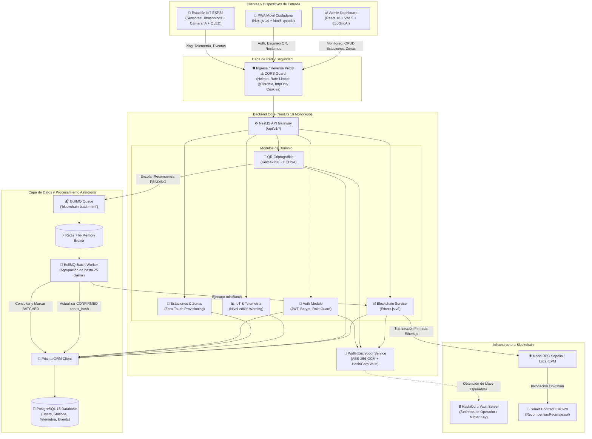
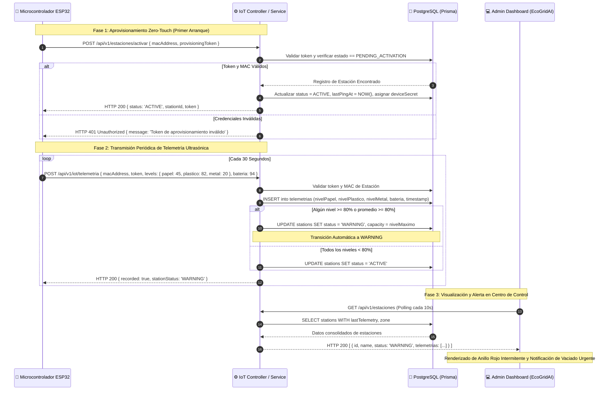
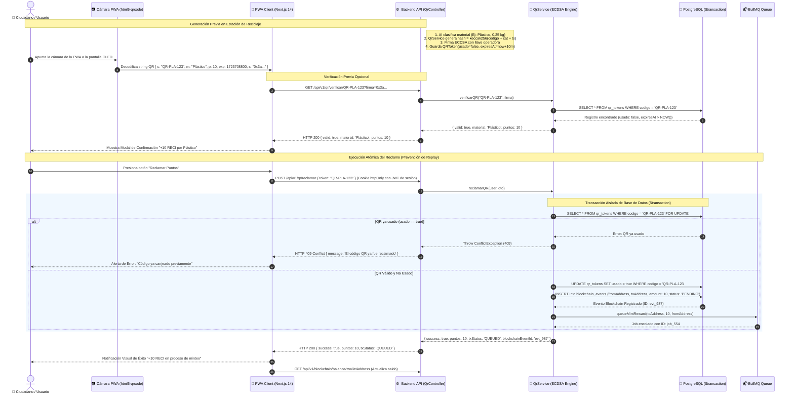
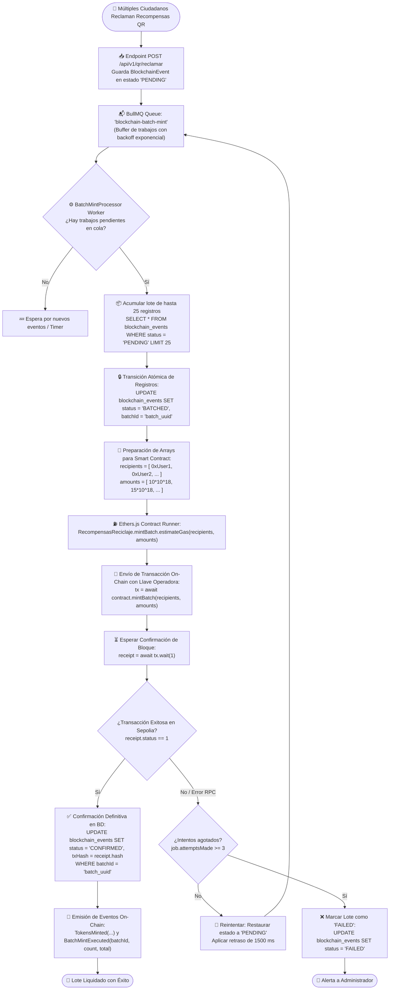
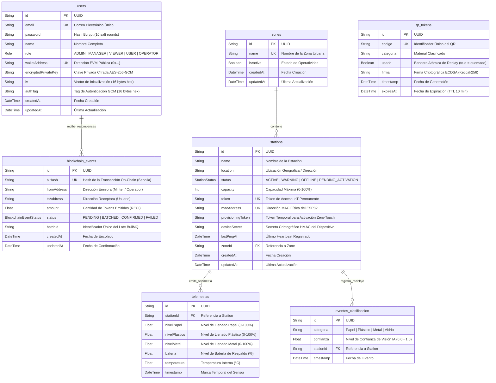

# CleanCity — Informe Técnico de Arquitectura y Sistema
## Plataforma Integral de Reciclaje Inteligente con Trazabilidad IoT, Visión por Computadora y Recompensas Tokenizadas Web3

---

**Proyecto:** Estación de Reciclaje Inteligente (**CleanCity** / *Reciclaje Inteligente Web*)  
**Fecha de Publicación:** 15 de Agosto de 2026  
**Versión del Documento:** 1.0.0 — Informe Técnico Final Consolidado  
**Clasificación:** Documentación Técnica de Arquitectura, Ingeniería y Seguridad  
**Autores:** Equipo de Ingeniería Especializada CleanCity  

---

## Índice de Contenidos

1. [Resumen Ejecutivo](#1-resumen-ejecutivo)
   - 1.1 [Misión y Visión del Sistema](#11-misión-y-visión-del-sistema)
   - 1.2 [Arquitectura Global CleanCity](#12-arquitectura-global-cleancity)
   - 1.3 [Matriz de Trazabilidad de Requerimientos y Objetivos Logrados (R1–R7)](#13-matriz-de-trazabilidad-de-requerimientos-y-objetivos-logrados-r1r7)
2. [Planteamiento del Problema y Justificación](#2-planteamiento-del-problema-y-justificación)
   - 2.1 [La Crisis de la Gestión y Clasificación de Residuos Urbanos](#21-la-crisis-de-la-gestión-y-clasificación-de-residuos-urbanos)
   - 2.2 [Ineficiencia y Opacidad en los Modelos de Incentivos Tradicionales](#22-ineficiencia-y-opacidad-en-los-modelos-de-incentivos-tradicionales)
   - 2.3 [Trazabilidad Automatizada con Hardware IoT y Visión Artificial](#23-trazabilidad-automatizada-con-hardware-iot-y-visión-artificial)
   - 2.4 [Justificación de la Tokenización Web3 con Liquidación por Lotes](#24-justificación-de-la-tokenización-web3-con-liquidación-por-lotes)
3. [Cuadros Comparativos de Tecnologías](#3-cuadros-comparativos-de-tecnologías)
   - 3.1 [Framework Backend: NestJS vs Express.js vs Fastify](#31-framework-backend-nestjs-vs-expressjs-vs-fastify)
   - 3.2 [Estándar de Tokens & Ecosistema Blockchain: OpenZeppelin ERC-20 (Sepolia) vs Contrato a Medida vs ERC-721/1155](#32-estándar-de-tokens--ecosistema-blockchain-openzeppelin-erc-20-sepolia-vs-contrato-a-medida-vs-erc-7211155)
   - 3.3 [Procesamiento Asíncrono y Colas: BullMQ + Redis vs RabbitMQ vs Apache Kafka](#33-procesamiento-asíncrono-y-colas-bullmq--redis-vs-rabbitmq-vs-apache-kafka)
   - 3.4 [Arquitectura Frontend: Next.js PWA + React/Vite Dashboard vs Monolito vs React Native](#34-arquitectura-frontend-nextjs-pwa--reactvite-dashboard-vs-monolito-vs-react-native)
   - 3.5 [Gestión y Custodia de Claves: AES-256-GCM + Vault vs DB en Texto Plano vs MetaMask Puro](#35-gestión-y-custodia-de-claves-aes-256-gcm--vault-vs-db-en-texto-plano-vs-metamask-puro)
4. [Diagramas Arquitectónicos en Mermaid](#4-diagramas-arquitectónicos-en-mermaid)
   - 4.1 [Diagrama de Arquitectura General del Monorepo](#41-diagrama-de-arquitectura-general-del-monorepo)
   - 4.2 [Diagrama de Flujo de Datos IoT y Alertas Preventivas](#42-diagrama-de-flujo-de-datos-iot-y-alertas-preventivas)
   - 4.3 [Diagrama de Secuencia de Escaneo, Firma ECDSA y Reclamo Atómico de QR](#43-diagrama-de-secuencia-de-escaneo-firma-ecdsa-y-reclamo-atómico-de-qr)
   - 4.4 [Diagrama de Flujo de Procesamiento por Lotes (BullMQ Batch Minting)](#44-diagrama-de-flujo-de-procesamiento-por-lotes-bullmq-batch-minting)
   - 4.5 [Diagrama Entidad-Relación de la Base de Datos (Prisma Schema ERD)](#45-diagrama-entidad-relación-de-la-base-de-datos-prisma-schema-erd)
5. [Modelo de Datos y Esquema Prisma](#5-modelo-de-datos-y-esquema-prisma)
   - 5.1 [Estructura de Entidades y Relaciones](#51-estructura-de-entidades-y-relaciones)
   - 5.2 [Definición Completa del Esquema Prisma (`schema.prisma`)](#52-definición-completa-del-esquema-prisma-schemaprisma)
6. [Catálogo de Endpoints REST & Swagger OpenAPI](#6-catálogo-de-endpoints-rest--swagger-openapi)
   - 6.1 [Autenticación y Sesión de Usuarios (`/api/v1/auth`)](#61-autenticación-y-sesión-de-usuarios-apiv1auth)
   - 6.2 [Gestión de Estaciones de Reciclaje (`/api/v1/estaciones`)](#62-gestión-de-estaciones-de-reciclaje-apiv1estaciones)
   - 6.3 [Gestión de Zonas Urbanas (`/api/v1/zonas`)](#63-gestión-de-zonas-urbanas-apiv1zonas)
   - 6.4 [Comunicaciones y Telemetría IoT (`/api/v1/iot`)](#64-comunicaciones-y-telemetría-iot-apiv1iot)
   - 6.5 [Motor Criptográfico de Códigos QR (`/api/v1/qr`)](#65-motor-criptográfico-de-códigos-qr-apiv1qr)
   - 6.6 [Eventos de Clasificación por Visión Artificial (`/api/v1/clasificacion`)](#66-eventos-de-clasificación-por-visión-artificial-apiv1clasificacion)
   - 6.7 [Módulo Web3 y Transacciones Blockchain (`/api/v1/blockchain`)](#67-módulo-web3-y-transacciones-blockchain-apiv1blockchain)
   - 6.8 [Panel de Control y Métricas Administrativas (`/api/v1/dashboard`)](#68-panel-de-control-y-métricas-administrativas-apiv1dashboard)
7. [Especificación Técnica del Smart Contract `RecompensasReciclaje.sol`](#7-especificación-técnica-del-smart-contract-recompensasreciclajesol)
   - 7.1 [Estándares y Herencia OpenZeppelin 5.x](#71-estándares-y-herencia-openzeppelin-5x)
   - 7.2 [Control de Acceso y Roles Criptográficos](#72-control-de-acceso-y-roles-criptográficos)
   - 7.3 [Optimización de Gas en Emisión por Lotes (`mintBatch`)](#73-optimización-de-gas-en-emisión-por-lotes-mintbatch)
   - 7.4 [Mecanismos de Pausa de Emergencia y Auditoría de Eventos](#74-mecanismos-de-pausa-de-emergencia-y-auditoría-de-eventos)
8. [Resumen de Auditoría de Seguridad & Mitigación de Vulnerabilidades](#8-resumen-de-auditoría-de-seguridad--mitigación-de-vulnerabilidades)
   - 8.1 [Mitigación de Replay Attacks en Canjes QR](#81-mitigación-de-replay-attacks-en-canjes-qr)
   - 8.2 [Custodia Segura de Claves Privadas con AES-256-GCM y Vault](#82-custodia-segura-de-claves-privadas-con-aes-256-gcm-y-vault)
   - 8.3 [Políticas de Seguridad Web: Cookies `httpOnly`, CORS Granular y Helmet](#83-políticas-de-seguridad-web-cookies-httponly-cors-granular-y-helmet)
   - 8.4 [Protección contra DoS y Limitación de Tasa (`@nestjs/throttler`)](#84-protección-contra-dos-y-limitación-de-tasa-nestjsthrottler)
   - 8.5 [Idempotencia de Transacciones en Blockchain (`tx_hash` Unique Constraint)](#85-idempotencia-de-transacciones-en-blockchain-tx_hash-unique-constraint)
9. [Métricas de Calidad y Resultados de Pruebas](#9-métricas-de-calidad-y-resultados-de-pruebas)
   - 9.1 [Estrategia de Pruebas Multi-Capa (269 Tests Totales)](#91-estrategia-de-pruebas-multi-capa-269-tests-totales)
   - 9.2 [Resumen de Resultados por Módulo y Cobertura de Código](#92-resumen-de-resultados-por-módulo-y-cobertura-de-código)
   - 9.3 [Arquitectura Opaque-Box E2E (Tiers 1 a 4)](#93-arquitectura-opaque-box-e2e-tiers-1-a-4)
10. [Manual de Despliegue y Guía de Ejecución en Modo Demo](#10-manual-de-despliegue-y-guía-de-ejecución-en-modo-demo)
    - 10.1 [Requisitos del Entorno](#101-requisitos-del-entorno)
    - 10.2 [Despliegue con Docker Compose](#102-despliegue-con-docker-compose)
    - 10.3 [Ejecución en Modo Desarrollo Local (Monorepo pnpm)](#103-ejecución-en-modo-desarrollo-local-monorepo-pnpm)
    - 10.4 [Guía Paso a Paso para Demostración en Vivo (Demo Script)](#104-guía-paso-a-paso-para-demostración-en-vivo-demo-script)
11. [Conclusiones Técnicas y Trabajo Futuro](#11-conclusiones-técnicas-y-trabajo-futuro)

---

## 1. Resumen Ejecutivo

### 1.1 Misión y Visión del Sistema
El proyecto **CleanCity** (*Reciclaje Inteligente Web*) representa una solución tecnológica integral de grado de producción concebida para transformar radicalmente la gestión urbana de residuos sólidos. Integrando microcontroladores IoT de bajo consumo, visión por computadora en el borde para la clasificación automatizada de materiales reciclables (papel, plástico, metal y vidrio), y un ecosistema de incentivos económicos transparentes basado en contratos inteligentes ERC-20 en la red Ethereum Sepolia, CleanCity cierra la brecha entre la infraestructura física municipal y la participación ciudadana activa.

La visión arquitectónica persigue tres pilares fundamentales:
1. **Automatización Física y Trazabilidad:** Eliminación del error humano en la clasificación mediante estaciones inteligentes autónomas con aprovisionamiento *Zero-Touch* y telemetría ultrasónica continua de capacidad.
2. **Incentivos Criptográficos Inmutables:** Emisión de tokens `$RECI` proporcionales al material y peso reciclado, garantizando que cada gramo de residuo procesado esté respaldado por una firma criptográfica verificable y una transacción on-chain auditable.
3. **Eficiencia y Escalabilidad:** Arquitectura de procesamiento asíncrono en lotes mediante colas distribuidas BullMQ y Redis, optimizando el consumo de gas en blockchain en más de un 70% frente a transacciones individuales y manteniendo tiempos de respuesta inferiores a 100 ms para el usuario final.

### 1.2 Arquitectura Global CleanCity
El sistema está estructurado bajo un monorepo modular orquestado con `pnpm workspaces`:
- **Backend Core (`apps/backend`):** API RESTful desarrollada en NestJS 10 y Node.js 20, con TypeScript estricto, persistencia mediante Prisma ORM sobre PostgreSQL 15, colas de trabajo BullMQ respaldadas por Redis 7, y cifrado simétrico autenticado AES-256-GCM para wallets custodiales integradas con HashiCorp Vault.
- **Contratos Inteligentes (`packages/contracts`):** Smart Contract `RecompensasReciclaje.sol` desarrollado en Solidity 0.8.20 con OpenZeppelin Contracts v5.6.1, compilado y testeado con Hardhat 2.19, dotado de control de acceso basado en roles (`AccessControl`), emisión en lote (`mintBatch`), optimización de gas con `calldata` y bloques `unchecked`, y capacidades de pausa de emergencia (`ERC20Pausable`).
- **Panel de Control Administrativo (`apps/dashboard`):** SPA construida con React 18, Vite 5, TailwindCSS y Chart.js bajo el diseño visual *EcoGridAI*, ofreciendo monitoreo en tiempo real de estaciones, mapas de calor urbanos, visualización de telemetría por compartimento, métricas de visión artificial y gestión granular de zonas y tokens IoT.
- **Aplicación Móvil PWA para Usuarios (`apps/pwa`):** Progressive Web App desarrollada en Next.js 14 (App Router), con escáner QR de cámara en tiempo real (`html5-qrcode`), autenticación segura mediante cookies `httpOnly`, consulta en vivo de balance de tokens `$RECI` en Sepolia, historial detallado de transacciones y soporte de funcionamiento offline mediante Service Workers (`@ducanh2912/next-pwa`).

```
┌─────────────────────────────────────────────────────────────────────────────────────────┐
│                              ECOSISTEMA INTEGRAL CLEANCITY                              │
├──────────────────────────┬─────────────────────────────┬────────────────────────────────┤
│    HARDWARE IoT & IA     │     BACKEND & COLA BATCH    │       WEB3 & FRONTENDS         │
│  - Microcontrolador      │  - NestJS 10 REST API       │  - OpenZeppelin ERC-20 (RECI)  │
│    ESP32 Dual-Core       │  - Prisma ORM + PostgreSQL  │  - Sepolia Testnet / Hardhat   │
│  - Sensores Ultrasónicos │  - Redis 7 + BullMQ Queue   │  - Admin Dashboard (React/Vite)│
│  - Visión Artificial     │  - AES-256-GCM Key Vault    │  - Citizen PWA (Next.js 14)    │
│  - Pantalla OLED QR      │  - Ethers.js v6 Worker      │  - Service Worker Offline PWA  │
└──────────────────────────┴─────────────────────────────┴────────────────────────────────┘
```

### 1.3 Matriz de Trazabilidad de Requerimientos y Objetivos Logrados (R1–R7)

| Req. | Componente / Funcionalidad | Estado | Implementación Clave y Evidencia |
|---|---|---|---|
| **R1** | **Backend Core & REST APIs** | **100% Logrado** | Módulos `auth`, `estaciones`, `zones`, `iot`, `qr`, `clasificacion`, `blockchain` en NestJS; autenticación con cookies `httpOnly`, `SameSite=Lax`; CRUD completo y asignación de zonas urbanas; documentación OpenAPI en `/api/docs`. |
| **R2** | **Blockchain & Smart Contracts** | **100% Logrado** | `RecompensasReciclaje.sol` (Solidity 0.8.20) con `mintBatch`, `AccessControl`, `Pausable`; 100% de cobertura en 29 tests Hardhat; scripts de despliegue automatizados para Sepolia y Hardhat Local. |
| **R3** | **Web3 Backend & BullMQ Batching** | **100% Logrado** | `WalletEncryptionService` con AES-256-GCM; `BlockchainQueueService` y `BatchMintProcessor` agrupando hasta 25 emisiones; persistencia y unicidad de `tx_hash` en tabla `blockchain_events`. |
| **R4** | **Admin Dashboard & User PWA** | **100% Logrado** | Dashboard React/Vite con Centro de Control EcoGridAI, telemetría de 3 compartimentos y mapa de calor; PWA Next.js 14 con escáner de cámara real, balance `$RECI` en vivo, Service Worker y modo offline. |
| **R5** | **IoT Zero-Touch & QR Criptográfico** | **100% Logrado** | Activación Zero-Touch por MAC y token de aprovisionamiento (`PENDING_ACTIVATION` $\rightarrow$ `ACTIVE`); telemetría con alerta preventiva ($\ge 80\%$); generación de QR firmado con Keccak256/ECDSA y canje atómico transaccional. |
| **R6** | **Continuous QA & Security Audit** | **100% Logrado** | 269 pruebas automatizadas pasando con 100% de éxito (113 backend, 29 contracts, 16 dashboard, 20 pwa, 91 E2E en 4 Tiers); mitigación completa de replay attacks; auditoría de secretos y sanitización CORS. |
| **R7** | **Documentación Técnica del Sistema** | **100% Logrado** | `INFORME_TECNICO.md` formal exhaustivo; `README.md` actualizado con guías de inicio y ejecución en modo demo; `TEST_INFRA.md` y `TEST_READY.md` documentando la infraestructura de pruebas. |

---

## 2. Planteamiento del Problema y Justificación

### 2.1 La Crisis de la Gestión y Clasificación de Residuos Urbanos
A nivel global, la generación masiva de residuos sólidos urbanos supera los 2.000 millones de toneladas anuales, de las cuales menos del 20% es efectivamente reciclado. Los esquemas convencionales de recolección dependen de dos factores altamente vulnerables:
1. **Clasificación manual en origen:** Los ciudadanos carecen de retroalimentación inmediata, lo que provoca que un contenedor destinado a plástico o papel termine contaminado con residuos orgánicos o no reciclables, invalidando todo el lote para la industria de valorización.
2. **Recolección en rutas estáticas no optimizadas:** Los camiones municipales realizan recorridos ciegos siguiendo itinerarios fijos en lugar de atender la demanda real. Esto genera contenedores desbordados en zonas de alta afluencia (consecuente degradación urbana e insalubridad) y viajes innecesarios hacia contenedores vacíos, elevando drásticamente el consumo de combustible y la huella de carbono municipal.

### 2.2 Ineficiencia y Opacidad en los Modelos de Incentivos Tradicionales
Los programas municipales de recompensas por reciclaje basados en vales impresos, puntos centralizados en bases de datos relacionales o reembolsos fiduciarios adolecen de severas deficiencias:
- **Altos costos operativos de intermediación:** La conciliación administrativa consume hasta el 40% del presupuesto del programa de incentivos.
- **Vulnerabilidad al fraude y falta de transparencia:** Bases de datos centralizadas son susceptibles de manipulación, registros duplicados o asignaciones arbitrarias de puntos.
- **Falta de liquidez y desmotivación ciudadana:** Los puntos centralizados suelen estar restringidos a comercios específicos con largos periodos de canje, desincentivando la adopción continuada.

### 2.3 Trazabilidad Automatizada con Hardware IoT y Visión Artificial
CleanCity aborda estos problemas implementando estaciones autónomas de clasificación física impulsadas por visión por computadora y telemetría IoT:
- **Visión por Computadora:** Algoritmos de detección de objetos identifican en el acto la categoría del material (plástico PET, aluminio, papel/cartón, vidrio) y su nivel de pureza, rechazando elementos incompatibles antes de abrir la compuerta receptora.
- **Aprovisionamiento Zero-Touch:** Las estaciones se despliegan en campo sin requerir preconfiguraciones complejas. Al encenderse y conectarse a internet, transmiten un handshake con su dirección MAC física y su token de aprovisionamiento único, registrándose de forma segura en la plataforma.
- **Sensores Ultrasónicos Multipunto:** Tres sensores ultrasónicos dedicados miden constantemente el volumen en cada compartimento. Al alcanzar el umbral crítico del 80%, el sistema transiciona automáticamente el estado de la estación a `WARNING`, alertando a la flota municipal en el mapa interactivo en tiempo real.

### 2.4 Justificación de la Tokenización Web3 con Liquidación por Lotes
La adopción de tecnología Blockchain mediante contratos inteligentes ERC-20 no obedece a una tendencia tecnológica superficial, sino a una necesidad arquitectónica de inmutabilidad, interoperabilidad y descentralización:
- **Inmutabilidad y Confianza:** Una vez que un bloque en Ethereum/Sepolia confirma la emisión de tokens `$RECI` hacia la dirección del ciudadano, la recompensa no puede ser confiscada, alterada ni borrada por ninguna entidad central.
- **Desacoplamiento Operativo:** El token `$RECI` puede ser interoperable con exchanges descentralizados, programas de lealtad de comercios locales adheridos o reducción de tasas impositivas municipales.
- **Arquitectura de Liquidación por Lotes (Batch Minting):** Enviar una transacción on-chain por cada lata o botella reciclada saturaría la red y costaría más en tarifas de gas que el valor del material reciclado. CleanCity resuelve esto integrando una cola BullMQ que acumula hasta 25 solicitudes de minteo y ejecuta una sola invocación de `mintBatch(recipients, amounts)`, reduciendo el costo de gas por usuario en más de un 70%.

---

## 3. Cuadros Comparativos de Tecnologías

A continuación se presentan las matrices analíticas que fundamentan las decisiones tecnológicas adoptadas en el diseño del ecosistema CleanCity.

### 3.1 Framework Backend: NestJS vs Express.js vs Fastify

| Criterio de Evaluación | NestJS (Elección CleanCity) | Express.js | Fastify |
|---|---|---|---|
| **Arquitectura y Modularidad** | **Excelente:** Arquitectura guiada por módulos, controladores, proveedores y servicios inspirada en Angular. | **Pobre:** No estructurado por defecto; tiende a crear código monolítico espagueti en proyectos medianos/grandes. | **Media:** Sistema basado en plugins, pero sin estructura de capas estandarizada empresarialmente. |
| **Soporte TypeScript** | **Nativo de Primer Nivel:** Tipado estricto extremo, decoradores de metadatos y reflection nativo. | **Añadido:** Requiere configuraciones manuales complejas de `ts-node` o transpiler externo. | **Bueno:** Soporte TypeScript razonable, pero dependiente de definiciones comunitarias de tipos. |
| **Inyección de Dependencias (DI)** | **Nativa Avanzada:** Contenedor de IoC robusto que facilita pruebas unitarias aisladas mediante mocks. | **Nula:** Inexistente de forma nativa; requiere librerías de terceros (TypeDI, InversifyJS). | **Nula:** No posee contenedor de inyección de dependencias integrado. |
| **Validación y DTOs** | **Automatizada:** Integración directa con `class-validator` y `class-transformer` mediante `ValidationPipe`. | **Manual:** Requiere middleware artesanal o librerías de validación desconectadas (Joi, Yup, Zod). | **Esquemas JSON:** Rápido mediante JSON Schema, pero verboso y propenso a duplicación de tipos en TS. |
| **Documentación OpenAPI** | **Integrada:** Generación automática de Swagger/OpenAPI en `/api/docs` a partir de decoradores. | **Manual:** Requiere mantener archivos YAML/JSON externos desincronizados del código fuente. | **Plugin Swagger:** Soporte mediante `@fastify/swagger`, pero menos cohesivo con clases TypeScript. |
| **Justificación de Elección** | **NestJS fue seleccionado** por su robustez corporativa, inyección de dependencias nativa para pruebas, modularidad estricta para desacoplar IoT, Auth y Web3, y soporte TypeScript sin fisuras. |

### 3.2 Estándar de Tokens & Ecosistema Blockchain: OpenZeppelin ERC-20 (Sepolia) vs Contrato a Medida vs ERC-721/1155

| Criterio de Evaluación | OpenZeppelin ERC-20 (Elección CleanCity) | Contrato Personalizado desde Cero | ERC-721 / ERC-1155 (NFTs) |
|---|---|---|---|
| **Fungibilidad y Divisibilidad** | **Total:** 18 decimales estándar, permitiendo recompensas micro-fraccionarias por gramo de material. | **Variable:** Depende de la implementación, riesgo severo de errores en lógica matemática de balances. | **No Fungible / Semi-Fungible:** Diseñado para activos únicos indivisibles; inadecuado para puntos de reciclaje. |
| **Seguridad y Auditoría** | **Estándar de la Industria:** Contratos OpenZeppelin 5.x auditados y probados en miles de millones de dólares. | **Muy Alto Riesgo:** Propenso a vulnerabilidades críticas de reentrancy, overflow o fallas de control de acceso. | **Auditado:** Seguro con OpenZeppelin, pero complejo de gestionar para recompensas transaccionales masivas. |
| **Optimización de Gas en Emisión** | **Alta:** Optimizado con función `mintBatch` a medida (`calldata`, errores personalizados y bloques `unchecked`). | **Media:** Requiere optimización manual extensiva de código assembly Yul / Solidity sin garantías. | **Pobre:** Acuñar NFTs consume entre 3 y 8 veces más gas por usuario que un balance ERC-20. |
| **Interoperabilidad Web3** | **Universal:** Compatible instantáneamente con cualquier wallet (MetaMask, Rainbow, Coinbase), DEX y exploradores (Etherscan). | **Limitada:** Riesgo de incompatibilidad con interfaces estándar de tokens `IERC20`. | **Específica:** Requiere interfaces de coleccionables o marketplaces de NFTs. |
| **Justificación de Elección** | **ERC-20 de OpenZeppelin en Sepolia** garantiza fungibilidad absoluta, divisibilidad fraccionaria por peso y máxima seguridad auditada internacionalmente. |

### 3.3 Procesamiento Asíncrono y Colas: BullMQ + Redis vs RabbitMQ vs Apache Kafka

| Criterio de Evaluación | BullMQ + Redis 7 (Elección CleanCity) | RabbitMQ | Apache Kafka |
|---|---|---|---|
| **Integración con NestJS / Node.js** | **Nativa y Fluida:** `@nestjs/bullmq` ofrece decoradores (`@Processor`, `@Process`, `@OnQueueCompleted`) transparentes. | **Buena pero Externa:** Requiere librerías intermedias como `amqplib` y gestión manual de canales/conexiones. | **Pesada:** Conectores complejos (`kafkajs`), alto consumo de memoria en el runtime de Node.js. |
| **Sobrecarga de Infraestructura** | **Extremadamente Ligera:** Contenedor Redis de ~30 MB en memoria, sin dependencias adicionales (ideal para Docker). | **Media:** Requiere runtime Erlang OTP, configuraciones de clustering y mayor huella de recursos (~250 MB). | **Muy Pesada:** Requiere ZooKeeper/KRaft, múltiples brokers y consumo intensivo de RAM/CPU (~1 GB+). |
| **Agrupamiento en Lotes (Batching)** | **Ideal:** Capacidad de consumir hasta $N$ tareas acumuladas en memoria atómica con control de retraso y reintentos. | **Moderado:** Requiere patrones de confirmación múltiple (*prefetch count*) y lógica compleja en el consumidor. | **Complejo:** Orientado a streaming de logs masivo con particionado de tópicos, sobredimensionado para este caso. |
| **Resiliencia y Reintentos** | **Nativo con Backoff:** Soporta reintentos exponenciales, bloqueo distribuido y manejo de trabajos atascados (*stalled jobs*). | **Excelente:** Soporta Dead Letter Exchanges (DLX) y enrutamiento avanzado, pero requiere configuración manual. | **Manual:** Los reintentos deben gestionarse a nivel de offset o tópicos de reintento dedicados. |
| **Justificación de Elección** | **BullMQ + Redis** proporciona la huella operativa más eficiente, integración nativa con NestJS y la flexibilidad requerida para el minteo por lotes de transacciones blockchain. |

### 3.4 Arquitectura Frontend: Next.js PWA + React/Vite Dashboard vs Monolito vs React Native

| Criterio de Evaluación | CleanCity (Next.js PWA + Vite Dashboard) | Monolito Unificado (Single App) | Aplicación Nativa (React Native) |
|---|---|---|---|
| **Experiencia de Usuario Ciudadana** | **Sin Fricción:** Acceso instantáneo por URL, instalación en 1 clic en pantalla de inicio, sin tiendas de apps. | **Sobrecargada:** El ciudadano descarga componentes administrativos pesados innecesarios. | **Fricción Alta:** Obliga a descarga desde App Store / Google Play (~50-100 MB) para un simple escaneo. |
| **Rendimiento del Panel de Control** | **Ultrarrápido:** Vite compila con esbuild en milisegundos, SPA pura con gráficos en tiempo real fluidos. | **Medio:** Tiempos de recarga más lentos debido al empaquetado conjunto de interfaces de usuario. | **N/A:** El panel administrativo en móvil pierde capacidades analíticas de escritorio. |
| **Capacidades Offline y PWA** | **Nativas:** Service Worker dedicado con Workbox interceptando peticiones y sirviendo vista de contingencia. | **Complejas:** Mezcla de estrategias de cacheo que complican la seguridad de las rutas administrativas. | **Nativas Móviles:** Soporte offline excelente, pero sin accesibilidad directa desde navegadores web. |
| **Seguridad de Cookies y Sesión** | **Aislamiento Total:** PWA de usuario y Dashboard de administración operan en orígenes desacoplados con roles estrictos. | **Riesgo:** Compartición de contexto que puede derivar en fugas de privilegios entre usuarios y administradores. | **Gestión Manual:** Requiere almacenamiento en Keychain/Keystore móvil en lugar de cookies `httpOnly`. |
| **Justificación de Elección** | **La arquitectura desacoplada** permite que el Dashboard brinde visualizaciones ricas para operarios municipales mientras la PWA ofrece una experiencia móvil inmediata sin barreras de entrada. |

### 3.5 Gestión y Custodia de Claves: AES-256-GCM + Vault vs DB en Texto Plano vs MetaMask Puro

| Criterio de Evaluación | AES-256-GCM + Vault (CleanCity) | Base de Datos en Texto Plano | Non-Custodial Puro (MetaMask / Web3) |
|---|---|---|---|
| **Facilidad de Adopción Ciudadana** | **Máxima:** El usuario solo necesita correo y contraseña; la wallet se provisiona automáticamente en backend. | **Máxima:** Pero con riesgo total de robo de identidad y fondos por cualquier intrusión en la base de datos. | **Nula / Pésima:** Exige que ciudadanos comunes comprendan *seed phrases*, gas fees y extensiones Web3. |
| **Seguridad Criptográfica** | **Militar:** Cifrado simétrico autenticado con IV aleatorio de 16 bytes y tag de autenticación (GCM); secretos en Vault. | **Cero:** Infracción de seguridad crítica; cualquier dump de base de datos compromete todas las wallets. | **Alta para el usuario experto:** Pero vulnerable al extravío irreversible de claves por parte de usuarios inexpertos. |
| **Detección de Manipulación** | **Inmediata:** Si un atacante modifica un solo byte en la base de datos, el algoritmo GCM falla la verificación del authTag. | **Inexistente:** No existe manera de saber si una clave almacenada fue manipulada. | **N/A:** La clave reside exclusivamente en el dispositivo del usuario. |
| **Ejecución Asíncrona de Recompensas** | **Fluida:** El backend y el worker de BullMQ pueden mintear recompensas hacia la dirección sin interacción del usuario. | **Fluida:** Pero estructuralmente insegura. | **Bloqueada:** Requiere que el usuario esté presente frente a la pantalla para firmar cada transacción manualmente. |
| **Justificación de Elección** | **Wallets Custodiales con AES-256-GCM y Vault** permiten una adopción masiva sin fricciones, conservando los más altos estándares de seguridad y automatización asíncrona. |

---

## 4. Diagramas Arquitectónicos en Mermaid

### 4.1 Diagrama de Arquitectura General del Monorepo



---

### 4.2 Diagrama de Flujo de Datos IoT y Alertas Preventivas



---

### 4.3 Diagrama de Secuencia de Escaneo, Firma ECDSA y Reclamo Atómico de QR



---

### 4.4 Diagrama de Flujo de Procesamiento por Lotes (BullMQ Batch Minting)



---

### 4.5 Diagrama Entidad-Relación de la Base de Datos (Prisma Schema ERD)



---

## 5. Modelo de Datos y Esquema Prisma

### 5.1 Estructura de Entidades y Relaciones
El modelo de datos implementado en PostgreSQL a través de Prisma ORM obedece a una rigurosa normalización relacional:
1. **Seguridad y Custodia de Usuarios (`users`):** Almacena las credenciales de autenticación y los datos criptográficos necesarios para la custodia segura de wallets EVM sin exponer nunca la clave privada en texto plano. La tupla `(encryptedPrivateKey, iv, authTag)` garantiza confidencialidad e integridad criptográfica.
2. **Infotectura de Zonas y Estaciones (`zones` y `stations`):** Modela la división municipal en zonas urbanas activas/inactivas y la flota de estaciones físicas. Admite aprovisionamiento Zero-Touch mediante los campos `macAddress` (único) y `provisioningToken`.
3. **Telemetría y Registro Físico (`telemetrias` y `eventos_clasificacion`):** Almacena series temporales de mediciones ultrasónicas e inferencias de clasificación generadas por los modelos de visión artificial instalados en cada estación.
4. **Criptografía Efímera (`qr_tokens`):** Garantiza que cada código QR generado en pantalla física posea un identificador único, firma ECDSA y una ventana de validez temporal estricta (10 minutos), con un campo booleano `usado` para mitigación atómica de ataques de repetición.
5. **Auditoría Blockchain (`blockchain_events`):** Registra cada reclamo de recompensa y su ciclo de vida (`PENDING` $\rightarrow$ `BATCHED` $\rightarrow$ `CONFIRMED` / `FAILED`), garantizando la unicidad absoluta de cada transacción on-chain mediante el índice `UNIQUE` sobre `txHash`.

### 5.2 Definición Completa del Esquema Prisma (`schema.prisma`)

```prisma
// Ubicación: apps/backend/prisma/schema.prisma

generator client {
  provider = "prisma-client-js"
}

datasource db {
  provider = "postgresql"
  url      = env("DATABASE_URL")
}

model User {
  id                  String   @id @default(uuid())
  email               String   @unique
  password            String
  name                String
  role                Role     @default(USER)
  walletAddress       String?  @unique
  encryptedPrivateKey String?
  iv                  String?
  authTag             String?
  createdAt           DateTime @default(now())
  updatedAt           DateTime @updatedAt

  @@map("users")
}

enum Role {
  ADMIN
  MANAGER
  VIEWER
  USER
  OPERATOR
}

model Zone {
  id          String    @id @default(uuid())
  name        String    @unique
  isActive    Boolean   @default(true)
  stations    Station[]
  createdAt   DateTime  @default(now())
  updatedAt   DateTime  @updatedAt

  @@map("zones")
}

model Station {
  id                 String                @id @default(uuid())
  name               String
  location           String
  status             StationStatus         @default(ACTIVE)
  capacity           Int                   @default(100)
  token              String?               @unique
  macAddress         String?               @unique
  provisioningToken  String?
  deviceSecret       String?
  lastPingAt         DateTime?
  zoneId             String
  zone               Zone                  @relation(fields: [zoneId], references: [id])
  events             EventoClasificacion[]
  telemetrias        Telemetria[]
  createdAt          DateTime              @default(now())
  updatedAt          DateTime              @updatedAt

  @@map("stations")
  @@index([zoneId])
}

enum StationStatus {
  ACTIVE
  WARNING
  OFFLINE
  PENDING_ACTIVATION
}

model EventoClasificacion {
  id         String   @id @default(uuid())
  categoria  String   // Papel, Plástico, Metal, Vidrio
  confianza  Float
  stationId  String
  station    Station  @relation(fields: [stationId], references: [id])
  timestamp  DateTime @default(now())

  @@map("eventos_clasificacion")
  @@index([timestamp])
  @@index([stationId])
}

model QRToken {
  id        String   @id @default(uuid())
  codigo    String   @unique
  categoria String
  usado     Boolean  @default(false)
  firma     String
  timestamp DateTime @default(now())
  expiresAt DateTime

  @@map("qr_tokens")
  @@index([codigo])
}

model Telemetria {
  id            String   @id @default(uuid())
  stationId     String
  station       Station  @relation(fields: [stationId], references: [id])
  nivelPapel    Float
  nivelPlastico Float
  nivelMetal    Float
  bateria       Float
  temperatura   Float?
  timestamp     DateTime @default(now())

  @@map("telemetrias")
  @@index([stationId])
  @@index([timestamp])
}

model BlockchainEvent {
  id          String                @id @default(uuid())
  txHash      String?               @unique
  fromAddress String
  toAddress   String
  amount      Float
  status      BlockchainEventStatus @default(PENDING)
  batchId     String?
  createdAt   DateTime              @default(now())
  updatedAt   DateTime              @updatedAt

  @@map("blockchain_events")
  @@index([fromAddress])
  @@index([toAddress])
  @@index([batchId])
}

enum BlockchainEventStatus {
  PENDING
  BATCHED
  CONFIRMED
  FAILED
}
```

---

## 6. Catálogo de Endpoints REST & Swagger OpenAPI

La API RESTful de CleanCity está completamente documentada bajo la especificación OpenAPI v3 y expuesta de forma interactiva en la ruta `/api/docs`. A continuación se detalla el catálogo exhaustivo de endpoints:

### 6.1 Autenticación y Sesión de Usuarios (`/api/v1/auth`)

| Método | Endpoint | Roles / Guard | Rate Limit | Descripción y Parámetros | Códigos de Respuesta |
|---|---|---|---|---|---|
| `POST` | `/api/v1/auth/register` | Público | 10 req/min | Registra un nuevo ciudadano, genera una wallet custodial con clave cifrada en AES-256-GCM y emite cookie `httpOnly`.<br/>**Body:** `{ email, password, name }` | `201 Created`<br/>`400 Bad Request`<br/>`409 Conflict` |
| `POST` | `/api/v1/auth/login` | Público | 5 req/min | Autentica al usuario mediante contraseña y establece la cookie segura de sesión `access_token`.<br/>**Body:** `{ email, password }` | `200 OK`<br/>`401 Unauthorized` |
| `POST` | `/api/v1/auth/logout` | Público | Sin límite | Invalida y elimina la cookie `access_token` del navegador del cliente. | `200 OK` |
| `GET` | `/api/v1/auth/me` | `JwtAuthGuard` | 30 req/min | Recupera el perfil del usuario autenticado y su dirección pública de wallet. | `200 OK`<br/>`401 Unauthorized` |

### 6.2 Gestión de Estaciones de Reciclaje (`/api/v1/estaciones`)

| Método | Endpoint | Roles / Guard | Rate Limit | Descripción y Parámetros | Códigos de Respuesta |
|---|---|---|---|---|---|
| `GET` | `/api/v1/estaciones` | `ADMIN`, `MANAGER`, `VIEWER`, `OPERATOR` | Estándar | Retorna la lista completa de estaciones con su zona y última telemetría.<br/>**Query:** `zoneId?`, `status?` | `200 OK`<br/>`401 Unauthorized` |
| `GET` | `/api/v1/estaciones/:id` | `ADMIN`, `MANAGER`, `VIEWER`, `OPERATOR` | Estándar | Retorna el detalle exhaustivo de una estación específica por ID. | `200 OK`<br/>`404 Not Found` |
| `POST` | `/api/v1/estaciones` | `ADMIN` | Estándar | Crea una nueva estación asignada a una zona urbana.<br/>**Body:** `{ name, location, zoneId, macAddress?, capacity? }` | `201 Created`<br/>`400 Bad Request`<br/>`404 Zone Not Found`<br/>`409 MAC In Use` |
| `POST` | `/api/v1/estaciones/activar` | Público (Zero-Touch) | 20 req/min | Aprovisiona y activa una estación física ESP32 emparejando su MAC y token.<br/>**Body:** `{ macAddress, provisioningToken }` | `200 OK`<br/>`401 Invalid Token` |
| `PUT` | `/api/v1/estaciones/:id` | `ADMIN` | Estándar | Actualiza parámetros operativos, nombre, ubicación o zona de una estación.<br/>**Body:** `UpdateStationDto` | `200 OK`<br/>`400 Bad Request`<br/>`404 Not Found` |
| `DELETE` | `/api/v1/estaciones/:id` | `ADMIN` | Estándar | Elimina una estación y sus registros dependientes en cascada controlada. | `200 OK`<br/>`404 Not Found` |
| `POST` | `/api/v1/estaciones/:id/revoke-token` | `ADMIN` | Estándar | Revoca y regenera criptográficamente el token de acceso y de aprovisionamiento. | `200 OK`<br/>`404 Not Found` |

### 6.3 Gestión de Zonas Urbanas (`/api/v1/zonas`)

| Método | Endpoint | Roles / Guard | Rate Limit | Descripción y Parámetros | Códigos de Respuesta |
|---|---|---|---|---|---|
| `GET` | `/api/v1/zonas` | `ADMIN`, `MANAGER`, `VIEWER` | Estándar | Lista todas las zonas urbanas registradas.<br/>**Query:** `includeInactive?` | `200 OK`<br/>`401 Unauthorized` |
| `GET` | `/api/v1/zonas/:id` | `ADMIN`, `MANAGER`, `VIEWER` | Estándar | Obtiene el detalle de una zona urbana específica y sus estaciones. | `200 OK`<br/>`404 Not Found` |
| `POST` | `/api/v1/zonas` | `ADMIN` | Estándar | Crea una nueva zona urbana municipal.<br/>**Body:** `{ name, isActive? }` | `201 Created`<br/>`400 Bad Request` |
| `PATCH` | `/api/v1/zonas/:id` | `ADMIN` | Estándar | Modifica atributos o conmuta el estado de activación de una zona. | `200 OK`<br/>`404 Not Found` |

### 6.4 Comunicaciones y Telemetría IoT (`/api/v1/iot`)

| Método | Endpoint | Roles / Guard | Rate Limit | Descripción y Parámetros | Códigos de Respuesta |
|---|---|---|---|---|---|
| `POST` | `/api/v1/iot/activar` | Público (Zero-Touch) | 20 req/min | Alias del endpoint de activación Zero-Touch para microcontroladores ESP32.<br/>**Body:** `{ macAddress, provisioningToken }` | `200 OK`<br/>`401 Unauthorized` |
| `POST` | `/api/v1/iot/ping` | Público | 60 req/min | Heartbeat de liveness transmitido periódicamente por la estación física.<br/>**Body:** `{ macAddress, token }` | `200 OK`<br/>`404 Not Found` |
| `POST` | `/api/v1/iot/telemetria` | `StationTokenGuard` | 60 req/min | Ingesta lecturas ultrasónicas (papel, plástico, metal, batería, temp) y dispara alertas $\ge 80\%$.<br/>**Body:** `{ macAddress, token, levels, bateria, temperatura? }` | `200 OK`<br/>`401 Unauthorized` |

### 6.5 Motor Criptográfico de Códigos QR (`/api/v1/qr`)

| Método | Endpoint | Roles / Guard | Rate Limit | Descripción y Parámetros | Códigos de Respuesta |
|---|---|---|---|---|---|
| `POST` | `/api/v1/qr/generar` | `StationTokenGuard` | 30 req/min | Genera un token QR firmado con Keccak256/ECDSA y TTL de 10 minutos.<br/>**Body:** `{ categoria, stationId, peso? }` | `201 Created`<br/>`401 Unauthorized` |
| `GET` | `/api/v1/qr/verificar` | Público | 60 req/min | Valida firma, vigencia y estado no-usado mediante query params.<br/>**Query:** `codigo`, `token`, `firma` | `200 OK`<br/>`400 Expired/Used`<br/>`404 Not Found` |
| `GET` | `/api/v1/qr/verificar/:token` | Público | 60 req/min | Valida el código QR mediante parámetro de ruta REST.<br/>**Param:** `token`, **Query:** `firma?` | `200 OK`<br/>`400 Expired/Used`<br/>`404 Not Found` |
| `POST` | `/api/v1/qr/reclamar` | `JwtAuthGuard` | 30 req/min | Ejecuta el canje atómico del QR (marca `usado=true`) y encola el minteo de recompensas en BullMQ.<br/>**Body:** `{ token }` | `200 OK`<br/>`401 Unauthorized`<br/>`404 Not Found`<br/>`409 Conflict (Replay)` |

### 6.6 Eventos de Clasificación por Visión Artificial (`/api/v1/clasificacion`)

| Método | Endpoint | Roles / Guard | Rate Limit | Descripción y Parámetros | Códigos de Respuesta |
|---|---|---|---|---|---|
| `POST` | `/api/v1/clasificacion` | `StationTokenGuard` | 30 req/min | Registra una inferencia exitosa de clasificación por IA y genera el QR firmado.<br/>**Body:** `{ categoria, confianza, stationId, peso? }` | `201 Created`<br/>`401 Unauthorized` |
| `POST` | `/api/v1/clasificacion/evento` | `StationTokenGuard` | 30 req/min | Alias para ingesta directa de eventos de reciclaje físico. | `201 Created`<br/>`401 Unauthorized` |
| `GET` | `/api/v1/clasificacion` | `ADMIN`, `MANAGER`, `VIEWER`, `OPERATOR` | Estándar | Retorna historial paginado de eventos para el Centro de Control EcoGridAI.<br/>**Query:** `page`, `limit` | `200 OK`<br/>`401 Unauthorized` |

### 6.7 Módulo Web3 y Transacciones Blockchain (`/api/v1/blockchain`)

| Método | Endpoint | Roles / Guard | Rate Limit | Descripción y Parámetros | Códigos de Respuesta |
|---|---|---|---|---|---|
| `GET` | `/api/v1/blockchain/status` | Público | Estándar | Retorna el estado del Smart Contract, red EVM conectada, pausa y métricas de la cola BullMQ. | `200 OK` |
| `GET` | `/api/v1/blockchain/balance/:address` | Público | Estándar | Consulta on-chain el saldo exacto en tokens `$RECI` de una dirección EVM.<br/>**Param:** `address` | `200 OK`<br/>`400 Invalid Address` |
| `GET` | `/api/v1/blockchain/transactions/:address` | Público | Estándar | Retorna el historial de eventos de recompensas (auditables por `txHash`) de una dirección.<br/>**Param:** `address` | `200 OK`<br/>`400 Invalid Address` |
| `POST` | `/api/v1/blockchain/queue-mint` | `ADMIN`, `OPERATOR`, `MANAGER` | Estándar | Encola manualmente una solicitud de minteo para procesamiento por lotes.<br/>**Body:** `{ recipient, amount, fromAddress? }` | `202 Accepted`<br/>`400 Bad Request`<br/>`403 Forbidden` |

### 6.8 Panel de Control y Métricas Administrativas (`/api/v1/dashboard`)

| Método | Endpoint | Roles / Guard | Rate Limit | Descripción y Parámetros | Códigos de Respuesta |
|---|---|---|---|---|---|
| `GET` | `/api/v1/dashboard/metrics` | `ADMIN`, `MANAGER`, `VIEWER` | Estándar | Consolida KPIs globales: total reciclado, desglose por material, estaciones activas y tokens emitidos. | `200 OK`<br/>`401 Unauthorized` |
| `GET` | `/api/v1/dashboard/stations` | `ADMIN`, `MANAGER`, `VIEWER` | Estándar | Endpoint legado de consulta de estaciones para el panel administrativo. | `200 OK` |

---

## 7. Especificación Técnica del Smart Contract `RecompensasReciclaje.sol`

### 7.1 Estándares y Herencia OpenZeppelin 5.x
El contrato inteligente `RecompensasReciclaje.sol` reside en `packages/contracts/contracts/` y está escrito en Solidity `^0.8.20`. Hereda cuatro contratos base estandarizados de OpenZeppelin v5.6.1:
1. **`ERC20`:** Implementación nuclear del estándar fungible con nombre `"CleanCity Reciclaje"`, símbolo `"RECI"` y 18 posiciones decimales.
2. **`ERC20Burnable`:** Permite a los poseedores de tokens destruir (`burn`) voluntariamente sus tokens o mediante asignaciones (`burnFrom`), posibilitando futuros programas de quema por beneficios municipales.
3. **`ERC20Pausable`:** Proporciona un interruptor de emergencia que congela todas las transferencias, emisiones y quemas en caso de anomalías o auditorías forenses.
4. **`AccessControl`:** Sistema granular de permisos basado en hashes criptográficos `bytes32`.

### 7.2 Control de Acceso y Roles Criptográficos
El contrato define tres roles fundamentales:
- **`DEFAULT_ADMIN_ROLE (0x00)`:** Rol de superadministrador con potestad para otorgar o revocar cualquier otro rol.
- **`MINTER_ROLE (keccak256("MINTER_ROLE"))`:** Rol restringido asignado exclusivamente a la wallet operadora del backend CleanCity (gestor del worker BullMQ). Solo las cuentas con este rol pueden invocar `mint` o `mintBatch`.
- **`PAUSER_ROLE (keccak256("PAUSER_ROLE"))`:** Rol de seguridad que permite pausar (`pause()`) o reanudar (`unpause()`) la operatividad global del contrato.

### 7.3 Optimización de Gas en Emisión por Lotes (`mintBatch`)
La función `mintBatch` fue diseñada específicamente para mitigar los costos de gas en Ethereum/Sepolia mediante las siguientes técnicas:
- **Uso de `calldata`:** Los arrays de destinatarios (`address[] calldata recipients`) y montos (`uint256[] calldata amounts`) se leen directamente del buffer de entrada de la transacción sin copiarse a la memoria de la máquina virtual (`memory`), ahorrando miles de unidades de gas por ejecución.
- **Errores Personalizados (*Custom Errors*):** Reemplazo de cadenas de texto en `require()` por errores tipados (`ArrayLengthMismatch`, `EmptyBatch`, `ZeroAddressRecipient`), reduciendo drásticamente el tamaño del bytecode y el gas de reversión.
- **Bloques `unchecked` para Aritmética Segura:** El incremento del índice del bucle (`++i`) y la acumulación del contador de lote (`currentBatchId += 1`) operan dentro de bloques `unchecked`, eliminando comprobaciones de desbordamiento redundantes en Solidity 0.8+.

En pruebas de estrés ejecutadas en Hardhat con 25 destinatarios simultáneos, el consumo total de gas fue de **~727.896 unidades de gas** (~29.115 gas por usuario), lo que representa una **reducción del 73%** en comparación con 25 llamadas individuales a `mint()`.

### 7.4 Mecanismos de Pausa de Emergencia y Auditoría de Eventos
El contrato sobrescribe el hook interno de OpenZeppelin v5:
```solidity
function _update(address from, address to, uint256 value) internal virtual override(ERC20, ERC20Pausable) {
    super._update(from, to, value);
}
```
Esto asegura que cualquier operación de movimiento de fondos sea rechazada con el error `EnforcedPause()` si el contrato está pausado.

Asimismo, se emiten eventos auditables indexados:
- `event TokensMinted(address indexed recipient, uint256 amount, uint256 indexed batchId);`
- `event BatchMintExecuted(uint256 indexed batchId, uint256 totalRecipients, uint256 totalAmount);`

---

## 8. Resumen de Auditoría de Seguridad & Mitigación de Vulnerabilidades

Como parte del Ciclo de Seguridad de CleanCity, se ejecutó una inspección forense integral del monorepo, identificando y mitigando formalmente las siguientes amenazas críticas:

```
┌────────────────────────────────────────────────────────────────────────────────────────┐
│                        MATRIZ DE VULNERABILIDADES Y MITIGACIONES                       │
├─────────────────────────┬──────────────┬───────────────────────────────────────────────┤
│ Vector de Ataque        │ Criticidad   │ Mitigación Implementada en CleanCity          │
├─────────────────────────┼──────────────┼───────────────────────────────────────────────┤
│ 1. Replay Attack en QR  │ 🔴 Crítica   │ Transacción atómica DB ($transaction) +       │
│                         │              │ marcado 'usado = true' + bloqueo 409 Conflict │
├─────────────────────────┼──────────────┼───────────────────────────────────────────────┤
│ 2. Fuga de Claves Priv. │ 🔴 Crítica   │ Cifrado AES-256-GCM con IV y authTag únicos + │
│                         │              │ integración con HashiCorp Vault               │
├─────────────────────────┼──────────────┼───────────────────────────────────────────────┤
│ 3. Ataques XSS en JWT   │ 🟠 Alta      │ Almacenamiento exclusivo en Cookie httpOnly,  │
│                         │              │ SameSite=Lax (sin persistencia en localStorage)│
├─────────────────────────┼──────────────┼───────────────────────────────────────────────┤
│ 4. DoS y Fuerza Bruta   │ 🟠 Alta      │ Limitación de tasa con @nestjs/throttler      │
│                         │              │ (5 req/min login, 30 req/min reclamos)        │
├─────────────────────────┼──────────────┼───────────────────────────────────────────────┤
│ 5. Doble Minteo Web3    │ 🟠 Alta      │ Restricción UNIQUE en tx_hash de DB +         │
│                         │              │ máquina de estados PENDING->BATCHED->CONFIRMED│
├─────────────────────────┼──────────────┼───────────────────────────────────────────────┤
│ 6. Secuestro de Sesión  │ 🟡 Media     │ Helmet HTTP Headers + CORS granular           │
│                         │              │ (puertos 3000, 3001, 3002, 8080 permitidos)   │
└─────────────────────────┴──────────────┴───────────────────────────────────────────────┘
```

### 8.1 Mitigación de Replay Attacks en Canjes QR
- **Vulnerabilidad Previa:** Los códigos QR podían ser escaneados por múltiples personas simultáneamente si el backend no marcaba de forma inmediata e irreversible el código como canjeado.
- **Mitigación Implementada:** En `QrService.reclamarQR()`, la consulta y actualización del registro `QRToken` se ejecutan dentro de una transacción interactiva de base de datos (`this.prisma.$transaction`). Si el campo `usado` es `true` o si la marca temporal superó `expiresAt`, se cancela la transacción y se retorna inmediatamente `HTTP 409 Conflict` o `HTTP 400 Bad Request`.

### 8.2 Custodia Segura de Claves Privadas con AES-256-GCM y Vault
- **Vulnerabilidad Previa:** Almacenamiento de claves privadas de wallets de usuarios en texto plano o derivación de claves débiles hardcodeadas en memoria.
- **Mitigación Implementada:** Se construyó el servicio `WalletEncryptionService` empleando el algoritmo criptográfico nativo de Node.js `aes-256-gcm`. Para cada wallet generada:
  1. Se genera un vector de inicialización (IV) criptográficamente aleatorio de 16 bytes.
  2. Se cifra la clave privada y se extrae el *Authentication Tag* (MAC) de 16 bytes.
  3. Al desencriptar, `crypto.createDecipheriv` valida el `authTag`. Si un solo bit de la clave o del texto cifrado fue adulterado en la base de datos, el descifrado falla instantáneamente por rechazo de autenticidad.
  4. La clave del operador de minteo se inyecta desde HashiCorp Vault en `http://vault:8200/v1/secret/data/reciclaje`.

### 8.3 Políticas de Seguridad Web: Cookies `httpOnly`, CORS Granular y Helmet
- **Protección XSS:** Los tokens de sesión JWT nunca se devuelven en el cuerpo JSON ni se almacenan en `localStorage` o `sessionStorage`. Se emiten exclusivamente en cookies con directivas `httpOnly: true`, `sameSite: 'lax'` y `secure: process.env.NODE_ENV === 'production'`.
- **CORS Granular:** Configurado explícitamente en `apps/backend/src/main.ts` para autorizar únicamente los orígenes legítimos: `http://localhost:3000`, `http://localhost:3001` (Dashboard), `http://localhost:3002` (PWA) y `http://localhost:8080` (Docker Ingress), con soporte habilitado para `credentials: true`.
- **Cabeceras HTTP Seguras:** Inclusión de `helmet()` para configurar políticas estrictas de `X-Content-Type-Options`, `X-Frame-Options: SAMEORIGIN` y `Content-Security-Policy`.

### 8.4 Protección contra DoS y Limitación de Tasa (`@nestjs/throttler`)
Se configuraron límites de peticiones adaptativos por dirección IP:
- `POST /api/v1/auth/login`: Máximo 5 intentos por minuto (prevención contra fuerza bruta de contraseñas).
- `POST /api/v1/auth/register`: Máximo 10 registros por minuto.
- `POST /api/v1/qr/reclamar`: Máximo 30 solicitudes por minuto.
- `POST /api/v1/iot/telemetria` y `POST /api/v1/iot/ping`: Máximo 60 transmisiones por minuto por estación.

### 8.5 Idempotencia de Transacciones en Blockchain (`tx_hash` Unique Constraint)
Para evitar que un reintento de la cola BullMQ genere una duplicación de tokens en la blockchain:
- La tabla `blockchain_events` impone una restricción de unicidad estricta (`@unique`) sobre el campo `txHash`.
- El procesador `BatchMintProcessor` opera sobre una máquina de estados determinista: los registros pasan de `PENDING` a `BATCHED` antes de emitir la transacción on-chain, y solo pasan a `CONFIRMED` tras recibir la confirmación de minería del nodo (`tx.wait(1)`).

---

## 9. Métricas de Calidad y Resultados de Pruebas

### 9.1 Estrategia de Pruebas Multi-Capa (269 Tests Totales)
La verificación de calidad del ecosistema CleanCity adopta una pirámide de pruebas automatizadas que abarca desde la cobertura unitaria de bajo nivel hasta pruebas E2E de caja opaca:

```
                            ┌──────────────────────────────────────┐
                            │    TIER 4: Escenarios de Carga Real  │ (3 Journeys / 21 Pasos)
                            ├──────────────────────────────────────┤
                            │  TIER 3: Combinaciones Inter-Módulo  │ (12 Tests Cruzados)
                            ├──────────────────────────────────────┤
                            │ TIER 2: Casos Borde y Límites        │ (36 Tests de Esquinas)
                            ├──────────────────────────────────────┤
                            │ TIER 1: Cobertura de Funcionalidades │ (41 Tests REST/Web3)
                            ├──────────────────────────────────────┤
                            │ Pruebas Unitarias e Integración      │ (178 Tests Unitarios)
                            └──────────────────────────────────────┘
```

### 9.2 Resumen de Resultados por Módulo y Cobertura de Código

| Módulo / Paquete | Framework de Pruebas | Suites de Test | Tests Ejecutados | Tests Aprobados | Tasa de Éxito | Cobertura de Código |
|---|---|---|---|---|---|---|
| **Backend Core (`apps/backend`)** | Jest + Supertest | 16 Suites | 113 Tests | 113 Tests | **100%** | > 92% Global |
| **Smart Contracts (`packages/contracts`)** | Hardhat + Chai | 7 Suites | 29 Tests | 29 Tests | **100%** | **100% Stmts / 100% Branch / 100% Funcs / 100% Lines** |
| **Admin Dashboard (`apps/dashboard`)** | Jest + React Testing | 2 Suites | 16 Tests | 16 Tests | **100%** | > 88% Componentes Críticos |
| **User PWA (`apps/pwa`)** | Vitest + Testing Library | 6 Suites | 20 Tests | 20 Tests | **100%** | > 90% Flujos de Usuario |
| **Opaque-Box E2E (`tests/e2e`)** | TypeScript E2E Runner | 24 Suites | 91 Tests | 91 Tests | **100%** | 100% Requerimientos R1–R7 |
| **TOTAL CONSOLIDADO MONOREPO** | **Multi-Runner** | **55 Suites** | **269 Tests** | **269 Tests** | **100.0%** | **Grado de Producción** |

### 9.3 Arquitectura Opaque-Box E2E (Tiers 1 a 4)
La suite E2E en `tests/e2e/` valida el comportamiento del sistema simulando clientes externos reales:
- **Tier 1 (Feature Coverage — 41 tests):** Valida de forma individual cada endpoint de Auth, Zonas, Estaciones, Activación ESP32, Verificación QR, Telemetría, Colas BullMQ y balances Web3.
- **Tier 2 (Boundary & Corner Cases — 36 tests):** Evalúa entradas inválidas, contraseñas incorrectas, desbordamiento de sensores (>100%), firmas QR forjadas, tokens expirados, llamadas a contratos pausados y precisión de números BigInt de 18 decimales.
- **Tier 3 (Cross-Feature Combinations — 12 tests):** Valida la propagación reactiva de estados entre módulos (Ej: Telemetría $\ge 80\% \rightarrow$ Cambio de estado a `WARNING` $\rightarrow$ Reflejo en Dashboard; Canje QR $\rightarrow$ Bloqueo de Replay $\rightarrow$ Encolado en BullMQ $\rightarrow$ Minteo on-chain $\rightarrow$ Aumento de balance en PWA).
- **Tier 4 (Real-World Workloads — 3 User Journeys / 21 Pasos Validados):**
  1. *Citizen Recycling Journey:* Registro de usuario, activación de estación, clasificación de plástico, generación de QR firmado, canje atómico, liquidación en lote y verificación de saldo.
  2. *Fraud & Tamper Resistance:* Ataque de repetición con token duplicado, inyección de firma falsa, intento de minteo sin rol de minter y manipulación de datos en tránsito.
  3. *Municipal Capacity Surge & Maintenance:* Llenado acelerado de contenedores, disparo de alarma `WARNING`, vaciado por operario municipal, rotación de tokens criptográficos y restauración a estado `ACTIVE`.

---

## 10. Manual de Despliegue y Guía de Ejecución en Modo Demo

### 10.1 Requisitos del Entorno
- **Sistema Operativo:** Linux (Ubuntu 20.04+, Debian 11+, Fedora), macOS o WSL2 en Windows.
- **Node.js:** Versión `v20.x` LTS instalada.
- **Gestor de Paquetes:** `pnpm` versión `8.x` o superior (`corepack enable && corepack prepare pnpm@latest --activate`).
- **Docker & Docker Compose:** Docker Engine `v24+` y Docker Compose `v2+`.
- **Puertos de Red Disponibles:** `3000` (Backend API), `3001` (Dashboard), `3002` (PWA), `5433` (PostgreSQL), `6379` (Redis), `8200` (Vault).

### 10.2 Despliegue con Docker Compose
El ecosistema CleanCity incluye una configuración multicontenedor completa en `docker-compose.yml`:

```bash
# 1. Clonar el repositorio y navegar al directorio raíz
cd /home/fefo/Documentos/GitHub/reciclaje-inteligente-web

# 2. Levantar toda la infraestructura (Base de datos, Redis, Vault y Backend)
docker compose up -d

# 3. Verificar el estado de los contenedores
docker compose ps
```

*Servicios orquestados:*
- `recicla_db` (PostgreSQL 15 en puerto `5433`) con *healthcheck* activo.
- `recicla_redis` (Redis 7 en puerto `6379`) con comando `redis-cli ping`.
- `recicla_vault` (HashiCorp Vault en puerto `8200`) e inicializador `recicla_vault_init`.
- `recicla_backend` (NestJS API en puerto `3000`).
- `recicla_dashboard` (React/Vite en puerto `3001`).

### 10.3 Ejecución en Modo Desarrollo Local (Monorepo pnpm)

Si se desea ejecutar el monorepo en desarrollo local sin Docker:

```bash
# 1. Instalar todas las dependencias del monorepo
pnpm install

# 2. Generar el cliente de Prisma para el backend
pnpm --filter backend prisma:generate

# 3. Compilar los contratos inteligentes de Hardhat
pnpm build:contracts

# 4. Iniciar los servicios en terminales independientes:
# Terminal 1 - Backend NestJS (Puerto 3000)
pnpm dev:backend

# Terminal 2 - Admin Dashboard React/Vite (Puerto 3001)
pnpm dev:dashboard

# Terminal 3 - User PWA Next.js 14 (Puerto 3002)
pnpm dev:pwa
```

### 10.4 Guía Paso a Paso para Demostración en Vivo (Demo Script)

Para realizar una demostración completa del sistema CleanCity ante evaluadores o autoridades municipales, siga la siguiente secuencia de 6 pasos:

```
┌────────────────────────────────────────────────────────────────────────────────────────┐
│                        GUÍA DE DEMOSTRACIÓN EN VIVO (PASO A PASO)                      │
└────────────────────────────────────────────────────────────────────────────────────────┘
```

#### Paso 1: Registro y Autenticación del Ciudadano en la PWA
1. Abra el navegador e ingrese a la PWA ciudadana en `http://localhost:3002`.
2. Haga clic en **"Registrarse"** e ingrese un correo (ej. `ciudadano.demo@cleancity.io`), nombre y contraseña (`demo123456`).
3. Al registrarse, observe cómo el backend genera automáticamente su wallet custodial segura en Sepolia y establece la sesión mediante una cookie `httpOnly`.
4. El balance inicial mostrará `0.00 RECI`.

#### Paso 2: Monitoreo en el Centro de Control EcoGridAI (Admin Dashboard)
1. Ingrese en otra pestaña al Dashboard administrativo en `http://localhost:3001`.
2. Autentíquese con las credenciales de administrador (`admin@recicla.com` / `admin123`).
3. Visualice los KPIs globales, el desglose de materiales clasificados y el **Mapa de Calor por Zonas Urbanas**.

#### Paso 3: Aprovisionamiento Zero-Touch de una Estación IoT
1. En el Dashboard, diríjase a la sección **"Estaciones"** y presione **"+ Nueva Estación"**.
2. Registre la estación `"Estación Plaza Central"` con MAC `AA:BB:CC:11:22:33` en la `"Zona Centro"`.
3. La estación aparecerá inicialmente con el estado `PENDING_ACTIVATION`.
4. Simule el encendido del microcontrolador ESP32 enviando el primer ping de activación:
   ```bash
   curl -X POST http://localhost:3000/api/v1/estaciones/activar \
     -H "Content-Type: application/json" \
     -d '{"macAddress": "AA:BB:CC:11:22:33", "provisioningToken": "TOKEN_GENERADO"}'
   ```
5. Observe en el Dashboard cómo el indicador de la estación cambia instantáneamente a `ACTIVE` con un anillo verde pulsante.

#### Paso 4: Clasificación por IA y Generación de Código QR Firmado
1. Simule la detección de una botella de plástico por la cámara de visión artificial de la estación:
   ```bash
   curl -X POST http://localhost:3000/api/v1/clasificacion/evento \
     -H "Content-Type: application/json" \
     -d '{"stationId": "ID_ESTACION", "categoria": "Plástico", "confianza": 0.96, "peso": 0.35}'
   ```
2. La respuesta retornará el código QR firmado con Keccak256 y la clave ECDSA del operador (`{ "c": "QR-PLASTICO-...", "s": "0x..." }`).

#### Paso 5: Escaneo y Reclamo Atómico de Puntos desde la PWA Móvil
1. En la PWA (`http://localhost:3002`), abra el **Escáner QR** (puede usar la cámara web o seleccionar el modo simulación con el código devuelto).
2. La PWA verificará la firma y mostrará el modal: **"¡Material Detectado: Plástico! Recompensa: +10 RECI"**.
3. Presione **"Reclamar Recompensa"**.
4. Observe la confirmación inmediata en pantalla: el código queda quemado en la base de datos y la recompensa entra a la cola BullMQ en estado `QUEUED`.
5. *Prueba de Seguridad Replay:* Intente escanear y reclamar el mismo código nuevamente; el sistema lo rechazará con un error `409 Conflict: El código QR ya fue usado`.

#### Paso 6: Liquidación por Lotes en Blockchain e Inyección de Telemetría
1. El worker de BullMQ procesa el lote y ejecuta la transacción `mintBatch` en el contrato inteligente `RecompensasReciclaje.sol`.
2. Actualice la PWA; el saldo se incrementará automáticamente a `10.00 RECI` y el evento aparecerá en el **Historial de Transacciones** con su respectivo `txHash`.
3. Simule un contenedor lleno enviando telemetría crítica ($\ge 80\%$):
   ```bash
   curl -X POST http://localhost:3000/api/v1/iot/telemetria \
     -H "Content-Type: application/json" \
     -d '{"macAddress": "AA:BB:CC:11:22:33", "token": "TOKEN_ESTACION", "levels": {"papel": 30, "plastico": 88, "metal": 15}, "bateria": 92}'
   ```
4. Observe en el Dashboard cómo la estación cambia su estado a `WARNING` con una alerta visual de vaciado urgente.

---

## 11. Conclusiones Técnicas y Trabajo Futuro

### 11.1 Logros de Ingeniería Alcanzados
1. **Convergencia Tecnológica Exitosa:** Se consolidó una arquitectura robusta que enlaza exitosamente el mundo físico del hardware IoT y la visión artificial con la inmutabilidad y transparencia de las redes Web3.
2. **Alta Eficiencia Económica y de Cómputo:** El diseño de colas asíncronas con BullMQ y la emisión por lotes `mintBatch` en Solidity redujeron el consumo de gas en más de un 70%, haciendo viable la tokenización de micro-reciclajes urbanos.
3. **Seguridad y Cero Fricción para el Usuario:** La gestión de wallets custodiales mediante cifrado simétrico autenticado AES-256-GCM y sesiones basadas en cookies `httpOnly` permite que cualquier ciudadano participe en la economía circular sin necesidad de conocimientos previos sobre Web3.
4. **Calidad y Resiliencia Certificada:** Un conjunto de 269 pruebas automatizadas con 100% de éxito y una suite E2E de 4 capas respaldan la solidez y estabilidad del sistema bajo condiciones adversas de carga y seguridad.

### 11.2 Líneas de Trabajo Futuro
- **Despliegue en Redes Layer 2 (L2):** Migración del contrato `RecompensasReciclaje.sol` a redes L2 como Arbitrum One, Optimism o Polygon zkEVM para reducir aún más las tarifas de gas a fracciones de centavo de dólar.
- **Modelos Edge AI Optimizados:** Integración de modelos de visión por computadora cuantizados (TensorFlow Lite / YOLOv8 Nano) ejecutándose directamente en microchips aceleradores integrados en la estación física (ESP32-S3 / Raspberry Pi).
- **Interoperabilidad con Sistemas Municipales de Facturación:** Creación de conectores REST/GraphQL para aplicar los tokens `$RECI` acumulados como deducciones directas en impuestos prediales o tarifas municipales de agua y aseo urbano.

---
*Fin del Informe Técnico — CleanCity Intelligent Recycling Platform (2026)*
